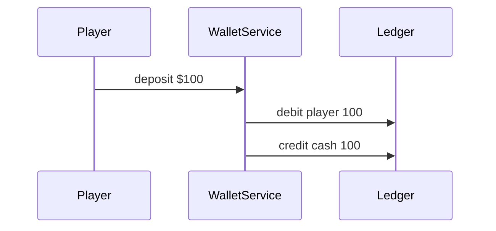

# Accounting Book

**Version:** 1.1.2
**Last Updated:** 2025-09-01

## Ledger Schema

Ledger code lives under [`backend/src/wallet`](../backend/src/wallet). The
daily reconciliation job is implemented in
[`backend/src/wallet/reconcile.job.ts`](../backend/src/wallet/reconcile.job.ts).

Operational response steps for ledger discrepancies are detailed in the [Wallet Reconciliation Runbook](./runbooks/wallet-reconciliation.md), and service availability targets are defined in the [service uptime SLO](./SLOs.md#service-uptime).

- **Account**: tracks the running balance for a wallet participant.
- **JournalEntry**: immutable rows recording debits and credits with a `refType` and `refId`.
- Every transaction writes equal and opposite entries so the sum of amounts per ref is zero.

### Ledger Flow

### Example Journal Entry

| entryId | account        | debit | credit | refType | refId |
|--------:|---------------|------:|-------:|---------|-------|
| 1       | player:alice   | 100   | 0      | deposit | dep1  |
| 2       | cash:house     | 0     | 100    | deposit | dep1  |

## Buy-ins and Payouts

- **Buy-in** – debits the player's account and credits the tournament or cash
  table pot.
- **Payout** – debits the pot and credits each qualifying player's account.
- **Rake** – credits the house account as a fee from the pot before payouts are
  distributed.

## Reconciliation Procedure

See the [Reconciliation Guide](./handbook/reconciliation-guide.md) for the end-to-end process and failure scenarios.
1. `WalletService.reconcile()` aggregates journal totals per account and compares them with stored balances.
2. The reconciliation job (`backend/src/wallet/reconcile.job.ts`) runs daily at midnight UTC.
3. Each run writes a JSON report under `storage/` named `reconcile-YYYY-MM-DD.json`.
4. If any account mismatches are detected the job throws, causing CI to fail.

## Ledger Integrity Tests
- Property-based test (`backend/test/wallet/reconcile.sum.property.spec.ts`) generates random transaction batches.
- For each batch `WalletService.reconcile()` must return no discrepancies and the totals must sum to zero.
- Any failing case writes the offending batch and report to `storage/wallet-reconcile-failure.json` and fails CI, ensuring ledger integrity.
- Additional property tests (`backend/test/wallet.ledger.property.ts`) verify that arbitrary transaction batches net to zero and that hand logs can be replayed to produce identical journal entries.  On failure the offending sequence is written to `storage/reconcile-YYYY-MM-DD.json` for investigation.

### Running `audit:ledger` Locally

Run `npm run audit:ledger` from the repository root to execute the ledger invariant checks. On success the command exits with code `0` and no artifacts are produced. If a counterexample is found the process fails and writes the offending batch and journal entries to `storage/reconcile-YYYY-MM-DD.json` for analysis. Remove the JSON file after investigation so subsequent runs are noise-free.

## KYC Provider Configuration

- External checks run against the URL defined by `KYC_PROVIDER_URL`.
- Results are cached in Redis for one hour to avoid repetitive lookups.
- When verification is denied the provider's message is returned via `/wallet/{id}/status`.

### Failure Modes

- **Provider not configured** – missing `KYC_PROVIDER_URL` causes all checks to fail.
- **Provider unreachable or error response** – the denial reason is cached and exposed to the client.

## Audit Controls

- Daily reconciliation reports are archived under `storage/` with immutable
  timestamps and SHA‑256 checksums.
- Quarterly external audits review journal entries, provider statements and
  reconciliation results.
- Findings and corrective actions are logged for regulatory inspection.

## Revision History
- 2025-08-31: linked wallet reconciliation runbook and service uptime SLO; added review footer
- 2025-09-01: document automated ledger replay audit
- cac8e82: add external KYC provider with denial reasons
- 36ba907: add reconcile zero-sum property test
- 3ab6709: add wallet reconciliation job and tests
- 2025-01-04: document revision history
- 2025-08-30: add version metadata, ledger flow diagram, and example
- 2025-08-30: cover buy-ins, payouts, and audit controls

---
_Last reviewed: 2025-08-31 by Nera26_

