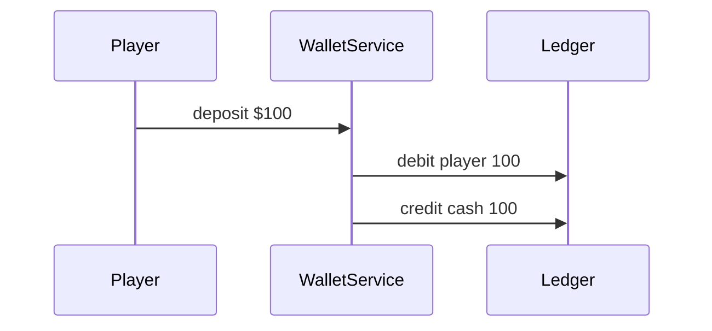

# Accounting Book

**Version:** 1.0.0  
**Last Updated:** 2025-08-30

## Ledger Schema
- **Account**: tracks the running balance for a wallet participant.
- **JournalEntry**: immutable rows recording debits and credits with a `refType` and `refId`.
- Every transaction writes equal and opposite entries so the sum of amounts per ref is zero.

### Ledger Flow

### Example Journal Entry

| entryId | account        | debit | credit | refType | refId |
|--------:|---------------|------:|-------:|---------|-------|
| 1       | player:alice   | 100   | 0      | deposit | dep1  |
| 2       | cash:house     | 0     | 100    | deposit | dep1  |

## Reconciliation Procedure
1. `WalletService.reconcile()` aggregates journal totals per account and compares them with stored balances.
2. The reconciliation job (`backend/src/wallet/reconcile.job.ts`) runs daily at midnight UTC.
3. Each run writes a JSON report under `storage/` named `reconcile-YYYY-MM-DD.json`.
4. If any account mismatches are detected the job throws, causing CI to fail.

## Ledger Integrity Tests
- Property-based test (`backend/test/wallet/reconcile.sum.property.spec.ts`) generates random transaction batches.
- For each batch `WalletService.reconcile()` must return no discrepancies and the totals must sum to zero.
- Any failing case writes the offending batch and report to `storage/wallet-reconcile-failure.json` and fails CI, ensuring ledger integrity.

## KYC Provider Configuration

- External checks run against the URL defined by `KYC_PROVIDER_URL`.
- Results are cached in Redis for one hour to avoid repetitive lookups.
- When verification is denied the provider's message is returned via `/wallet/{id}/status`.

### Failure Modes

- **Provider not configured** – missing `KYC_PROVIDER_URL` causes all checks to fail.
- **Provider unreachable or error response** – the denial reason is cached and exposed to the client.

## Revision History
- cac8e82: add external KYC provider with denial reasons
- 36ba907: add reconcile zero-sum property test
- 3ab6709: add wallet reconciliation job and tests
- 2025-01-04: document revision history
- 2025-08-30: add version metadata, ledger flow diagram, and example
