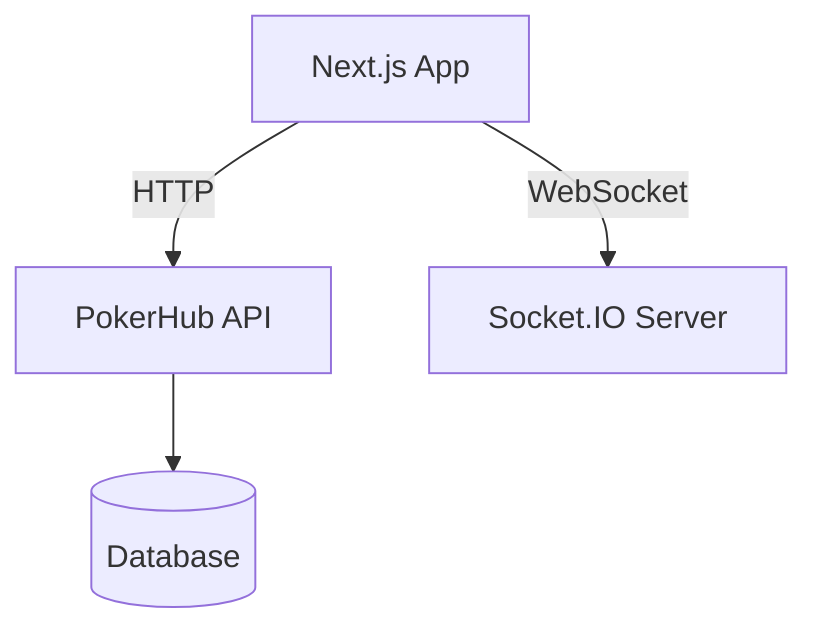
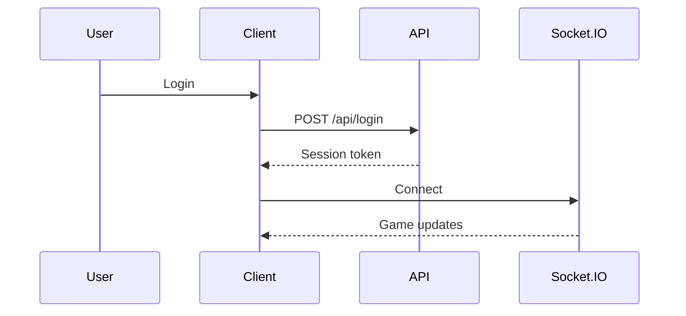

# Architecture Overview

This document outlines the high-level architecture and data flow of PokerHub.

## High-Level Architecture



## User Flow



## State Management

- **Zustand** stores live in `src/app/store`. Each store is isolated and composed with `useStore` for easy testing.
- **React Query** manages server state. Data-fetching hooks live under `src/hooks` and follow a `use<Resource>` naming convention. Queries are keyed by resource and invalidated on mutations.

## Directory Structure

```text
src/
  app/                # Next.js app directory and feature routes
    components/       # Reusable UI components
    store/            # Zustand stores
  hooks/              # Shared hooks such as API helpers
  lib/                # Utilities and services
  stories/            # Storybook stories
  types/              # TypeScript definitions
```
