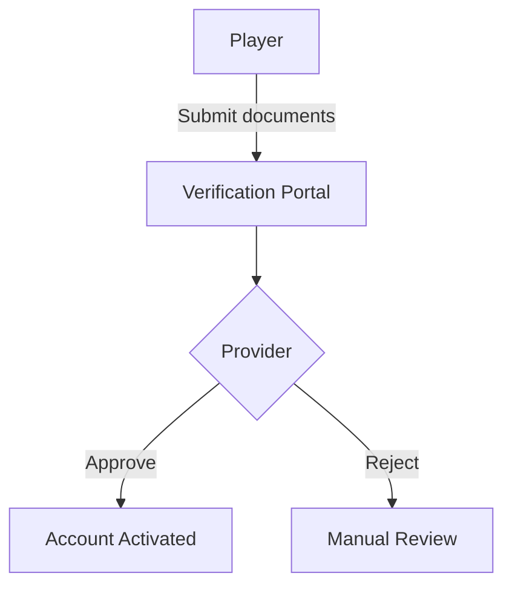
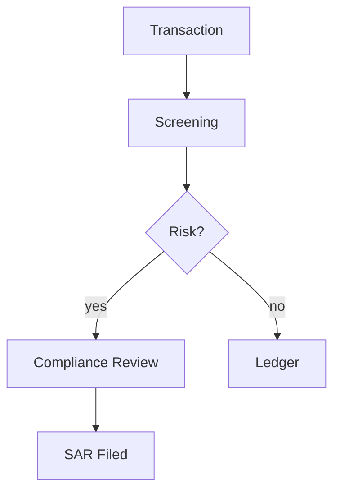

# KYC and AML Workflows

## KYC Verification

```mermaid
flowchart TD
  A[Player] -->|Submit documents| B[Verification Portal]
  B --> C{Provider}
  C -->|Approve| D[Account Activated]
  C -->|Reject| E[Manual Review]
```

## AML Monitoring

```mermaid
flowchart TD
  T[Transaction] --> S[Screening]
  S --> Q{Risk?}
  Q -- yes --> R[Compliance Review]
  R --> F[SAR Filed]
  Q -- no --> L[Ledger]
```

