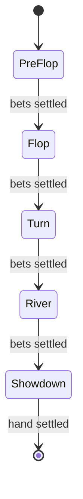

# Engine Specification

**Version:** 1.0.0
**Last Updated:** 2025-09-05

This document outlines the responsibilities and message flow of the PokerHub game engine.

## Overview

The engine advances a hand through betting streets, validates player actions, and
broadcasts state updates to all seated clients.  Implementation lives in
[`backend/src/game`](../backend/src/game).

## State Machine



## Messages

| Type | Description |
|------|-------------|
| `PlayerAction` | Client request containing an action id, type and optional amount. |
| `GameState` | Server broadcast showing pots, bets, seats and street. |

Both messages are JSON and validated with Zod schemas.

## Timers

- **Action:** 30 seconds per decision
- **Heartbeat:** 5 second keepalive
- **Reconnect Grace:** 90 seconds before seat is forfeited

## Retry & Idempotency

Actions carry a client‑generated `actionId`.  The server de‑duplicates on this
field so resubmitting is safe.  State endpoints are idempotent and may be
retried without side effects.

## Edge Cases

| Scenario | Resolution |
|---------|-----------|
| Simultaneous timeouts | Seat order determines who acts first. |
| All but one player disconnects | Remaining player wins the pot. |
| Player all‑in with fewer chips | Side pots track excess bets. |
| Tie at showdown | Pot split equally among winners. |
| Out‑of‑turn action | Server rejects and prompts correct player. |

## Verification

Any hand can be replayed from the action log.  Fetch the state at a specific
index via `GET /api/hands/{handId}/state/{actionIndex}` and compare to a client
simulation to prove determinism.

## Performance Regression Check

The socket load harness (`tests/performance/socket-load.ts`) simulates random
clients across thousands of tables and records per‑table latency histograms and
throughput.

Run locally with modest scale:

```bash
TABLES=100 SOCKETS=1000 npm run perf:socket-load
```

Metrics are written under `metrics/`:

- `latency-hist.json` – global p50/p95/p99 latency and dropped frame count.
- `table-metrics.json` – per table p50/p95/p99 and actions/min.

Thresholds (test fails when exceeded):

- p95 latency **≤120 ms** per table
- throughput **≥15 actions/min** per table

CI publishes the `metrics` directory as an artifact for dashboard ingestion.

