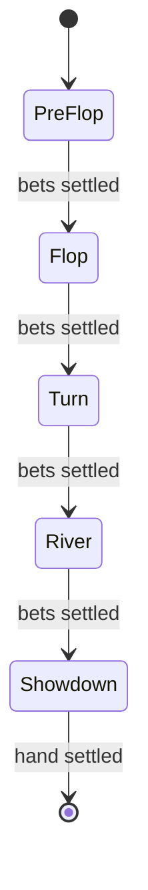

# Game Engine Specification

## State Machine


## Message Schemas

### `PlayerAction`
```json
{
  "type": "postBlind | bet | raise | call | check | fold | next",
  "tableId": "uuid",
  "playerId": "uuid",
  "amount": 100 // required for postBlind, bet, raise; optional for call
}
```

### `GameState`
```json
{
  "type": "table/state",
  "tableId": "uuid",
  "street": "preflop | flop | turn | river | showdown",
  "pot": 0,
  "currentBet": 0,
  "players": [
    { "id": "uuid", "stack": 100, "bet": 0, "folded": false, "allIn": false }
  ],
  "sidePots": [ { "amount": 0, "players": ["uuid"] } ]
}
```

## Timers

- **Action**: 30s per decision
- **Heartbeat**: 5s keepalive
- **Reconnect Grace**: 90s before seat is forfeited

## Edge Cases

- Simultaneous timeouts are resolved by seat order.
- If all but one player disconnect, the remaining player wins the pot.
- Side pots are created when a player is all-in with fewer chips.
- Ties are split equally among winning players.

## Mitigation Strategies

- Duplicate action protection via Redis idempotency keys.
- Rate limiting blocks clients after 30 actions in 10 seconds.
- Commit-reveal RNG proves deck fairness.
- Collusion tracking records user, device and IP on every action.
