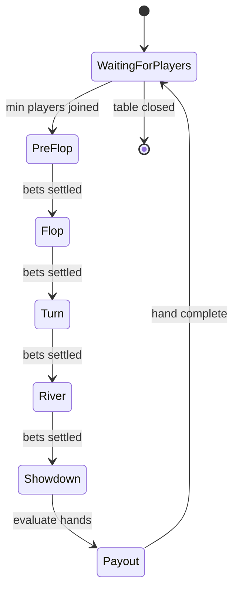

# Game Engine Specification

## State Machine


## Message Schemas

### `PlayerAction`
```json
{
  "type": "player/action",
  "tableId": "uuid",
  "playerId": "uuid",
  "action": "fold | call | raise",
  "amount": 100
}
```

### `StateChange`
```json
{
  "type": "table/state",
  "tableId": "uuid",
  "from": "PreFlop",
  "to": "Flop",
  "handId": "uuid"
}
```

## Timers

- **Action**: 30s per decision
- **Heartbeat**: 5s keepalive
- **Reconnect Grace**: 90s before seat is forfeited

## Edge Cases

- Simultaneous timeouts are resolved by seat order.
- If all but one player disconnect, the remaining player wins the pot.
- Side pots are created when a player is all-in with fewer chips.
- Ties are split equally among winning players.
