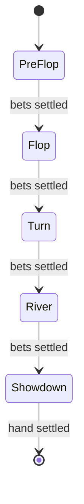
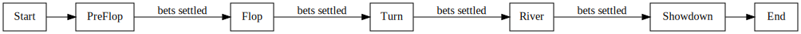
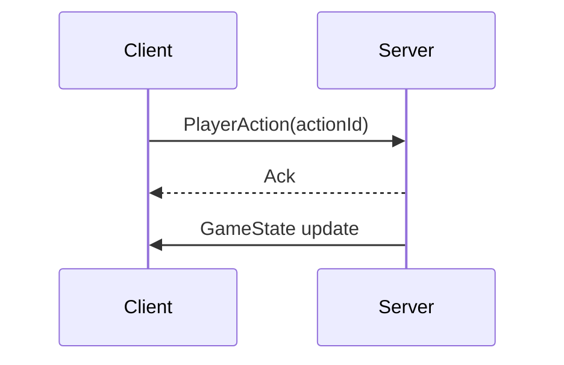

# Game Engine Specification

**Version:** 1.3.0
**Last Updated:** 2025-10-10

For upcoming milestones, see the [Milestone Roadmap](./roadmap.md).

Implementation lives under [`backend/src/game`](../backend/src/game) where the
state machine and engine workers are defined. Tournament operations are
documented in the [Tournament Handbook v1.2.0](./handbook/tournament-handbook.md), and ledger
procedures are covered in the [Reconciliation Guide v1.3.0](./handbook/reconciliation-guide.md).
Operational remediation steps are outlined in the [Stuck Hand Runbook](./runbooks/stuck-hand.md).
Service reliability targets are defined in the [Action ACK latency](./SLOs.md#game-action-ack-latency) and [Socket connect success](./SLOs.md#socket-connect-success) SLOs with remediation playbooks in the [Action ACK Latency](./runbooks/action-ack-latency.md) and [Socket Connect Success](./runbooks/socket-connect-success.md) runbooks.

## State Machine




## Message Schemas

### `PlayerAction`
```json
{
  "actionId": "uuid",
  "type": "postBlind | bet | raise | call | check | fold | next",
  "tableId": "uuid",
  "playerId": "uuid",
  "amount": 100 // required for postBlind, bet, raise; optional for call
}
```

### `GameState`
```json
{
  "version": "1",
  "tick": 42,
  "phase": "BETTING_ROUND",
  "street": "preflop | flop | turn | river | showdown",
  "pot": 0,
  "currentBet": 0,
  "players": [
    { "id": "uuid", "stack": 100, "bet": 0, "folded": false, "allIn": false }
  ],
  "sidePots": [ { "amount": 0, "players": ["uuid"] } ]
}
```
Frames must include a `version` string and monotonically increasing `tick` so
clients can resume streams and detect incompatible schema changes.

## State Verification

To validate that a hand progressed deterministically, any action in the log can be
replayed on demand.

Fetch the server-side reconstruction at a specific index:

```http
GET /api/hands/{handId}/state/{actionIndex}
```

The response is a `GameState` payload.  Clients can fetch the full log via
`GET /api/hands/{handId}/log` and independently replay actions to verify
the returned state matches their own simulation.

### Example

```bash
curl /api/hands/hand1/state/3 | jq
# {
#   "street": "flop",
#   "pot": 120,
#   "currentBet": 20,
#   "players": [ ... ]
# }
```

## Timers

- **Action**: 30s per decision
- **Heartbeat**: 5s keepalive
- **Reconnect Grace**: 90s before seat is forfeited

## Worker Architecture

Each table runs a primary engine worker alongside a follower worker. The
primary publishes state diffs to Redis while the follower consumes them and
maintains a synchronized snapshot. If the primary exits or stops responding, the
follower is promoted transparently. An OpenTelemetry gauge `room_follower_lag`
tracks how many actions the follower is behind the primary.

## Metrics & Tracing

The gateway emits OpenTelemetry spans for actions and tracks several metrics:

- `game_action_ack_latency_ms` – histogram of action ACK latency.
- `game_action_global_count` – histogram of actions within the global rate
  limit window.
- `frame_retries_total` / `frames_dropped_total` – counters for frame
  retransmission and drops.
- `per_socket_limit_exceeded` and `global_limit_exceeded` – counters for rate
  limit violations.

## Edge Cases

| Scenario | Resolution |
|---------|-----------|
| Simultaneous timeouts | Seat order determines who acts first. |
| All but one player disconnects | Remaining player wins the pot. |
| Player all-in with fewer chips | Side pots track excess bets. |
| Tie at showdown | Pot split equally among winners. |
| Out-of-turn action | Server rejects and prompts correct player. |

## Retry Semantics

- Each `PlayerAction` carries a unique `actionId` generated client-side.
- The server de-duplicates actions by `actionId`; resubmitting the same id is safe.
- Clients retry failed submissions up to three times with exponential backoff.
- State fetch endpoints are idempotent and may be retried without side effects.

## Message Flow Example



## Mitigation Strategies

- Duplicate action protection via Redis idempotency keys.
- Rate limiting blocks clients after 30 actions in 10 seconds.
- Commit-reveal RNG proves deck fairness; see the [RNG Whitepaper](./player/rng-whitepaper.md).
- Collusion tracking records user, device and IP on every action.

## Changelog
- **1.3.0** – 2025-10-10 – Document follower worker failover, versioned
  frames, and OpenTelemetry metrics.
- **1.2.2** – 2025-10-05 – Linked to RNG Whitepaper.
- **1.2.1** – 2025-08-31 – Linked SLO and runbook references; added review footer.
- **1.2.0** – 2025-08-30 – Cross-referenced tournament and reconciliation guides.
- **1.1.0** – 2025-08-30 – Added version metadata and message flow diagram.
- **1.0.0** – 2025-01-04 – Initial publication with hand log/state endpoints and SLO definitions.

---
_Last reviewed: 2025-10-10 by Nera26_

