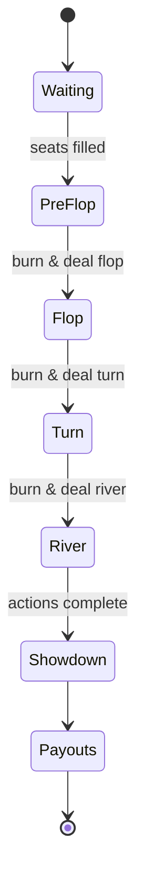

# Game Engine Overview

PokerHub's game engine orchestrates the lifecycle of each hand over a WebSocket connection. This document outlines the core states, messages, timers, and notable edge cases.

## State Diagram

Each transition is triggered by server events once required player actions are complete or their timers expire.

## Message Schemas

Messages flow over the `game` namespace. Key payloads:

- `state`: `{ handId, state, expiresAt }`
- `action`: `{ handId, playerId, type, amount? }`
- `deal`: `{ handId, street, cards }`
- `result`: `{ handId, payouts: [{ playerId, amount }] }`

All messages include an `id` and are encoded as JSON.

## Timers

| Timer            | Default | Purpose                                   |
|------------------|---------|-------------------------------------------|
| `actionTimer`    | 20 s    | Max time a player has to act              |
| `handTimeout`    | 2 m     | Fails the hand if it never completes      |
| `heartbeat`      | 10 s    | Detects dead WebSocket connections        |

Timers emit warnings five seconds before expiry so clients can surface countdowns.

## Edge Cases

- **Disconnect during action** – player auto-folds when `actionTimer` expires.
- **Simultaneous actions** – server queues actions and applies them in receipt order.
- **Empty table** – if all players leave, the hand ends and blinds are refunded.
- **Replay** – providing the same RNG seed reproduces dealing for debugging.
