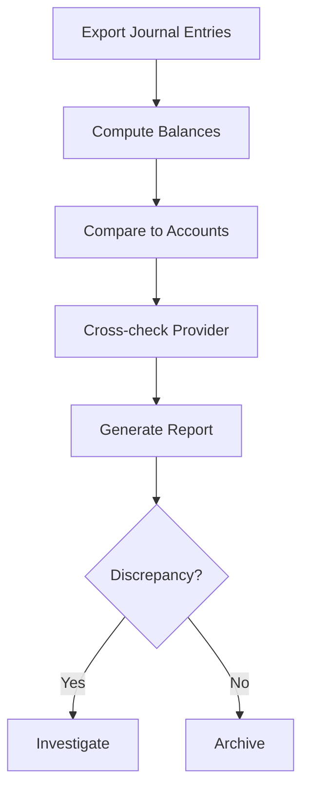

# Reconciliation Guide

**Version:** 1.2.1
**Last Updated:** 2025-10-05

This guide explains how wallet ledgers stay consistent and how disputes are resolved. Tournament flows are covered in the [Tournament Handbook](./tournament-handbook.md) and engine behavior in the [Game Engine Specification](../game-engine-spec.md). Operational steps are detailed in the [Wallet Reconciliation Runbook](../runbooks/wallet-reconciliation.md). The ledger schema is documented in the [Accounting Book](../accounting-book.md), and deck randomness is verified in the [RNG Whitepaper](../player/rng-whitepaper.md). Upcoming ledger enhancements are listed in the [Milestone Roadmap](../roadmap.md).

## Ledger Reconciliation

1. Export all `JournalEntry` rows for the period and sort by account and timestamp.
2. Compute a running balance per account using debits and credits.
3. Compare the computed balance with the `accounts.balance` column.
4. Cross‑check totals against payment provider statements.
5. Generate a daily report highlighting any deltas and archive it.
6. Investigate mismatches immediately; no gambling funds are released until resolved.

## Buy-ins and Payouts

Tournament buy-ins debit the player's account and credit the event pool. When a
game completes, payouts reverse the flow, debiting the pool and crediting each
winner. Reconciliation confirms that the sum of payouts plus rake equals the
total buy-ins for the event.

### Flow



### Example Reconciliation Run

| entryId | account        | debit | credit | runningBalance |
|--------:|---------------|------:|-------:|---------------:|
| 10      | player:alice   | 100   | 0      | 100 |
| 11      | cash:house     | 0     | 100    |   0 |
| 12      | player:alice   | 0     | 50     |  50 |
| 13      | cash:house     | 50    | 0      |  50 |

From these entries the computed balance for `player:alice` is `$50`. If the
`accounts.balance` column stores `$60`, the reconciliation report records a `$10`
delta and flags the account for investigation.

### CLI Walkthrough

```bash
# v1.1.0
node backend/src/wallet/reconcile.job.ts 2025-08-30
cat storage/reconcile-2025-08-30.json | jq '.[] | select(.delta != 0)'
```

1. Run the reconciliation job for a given date.
2. Inspect the generated report and filter for non‑zero deltas.
3. Investigate each flagged account and insert corrective entries before releasing funds.

## Failure Scenarios

| Scenario | Detection | Resolution |
|---------|-----------|------------|
| Missing journal entry | Running balance differs from provider report | Insert corrective entry and document root cause. |
| Double debit/credit | Duplicate reference IDs in `JournalEntry` | Reverse duplicate and alert engineering. |
| Provider outage | API reconciliation fails | Pause withdrawals and retry reconciliation when service restores. |
| Crash mid‑reconciliation | Report generation incomplete | Rerun reconciliation from last successful checkpoint. |

### Example Mismatch

Deposit provider reports $50, but journal shows $40 credit. Create a $10 corrective entry and note the discrepancy.

## Dispute Workflow

1. **Intake** – Support logs a ticket with account id, timeframe, and evidence.
2. **Triaging** – Operations replays journal entries and verifies provider transactions.
3. **Resolution** – If ledger is correct, communicate findings; otherwise write correcting entries.
4. **Escalation** – Unresolved cases escalate to compliance for regulatory reporting.

## Audit Trail

- All reconciliation runs and dispute outcomes are archived under `storage/` with immutable timestamps.
- Reports include the job run identifier and a SHA-256 checksum for tamper evidence.
- A typical record in `storage/reconcile-2025-08-30.json`:

```json
{
  "accountId": "player:alice",
  "expected": 60,
  "computed": 50,
  "delta": -10,
  "checksum": "9d2c...",
  "runId": "2025-08-30T00:00:00Z"
}
```

- Reports older than one year move to cold storage but remain retrievable for regulators.

## Changelog
- **1.2.1** – 2025-10-05 – Linked RNG Whitepaper and Accounting Book.
- **1.2.0** – 2025-10-05 – Cross-referenced engine spec and tournament handbook; converted revision history to changelog.
- **1.1.0** – 2025-10-05 – Added CLI walkthrough and version metadata.
- **1.0.0** – 2025-08-30 – Initial coverage with buy-ins/payouts reconciliation, flow diagram, and audit trail details.
---
_Last reviewed: 2025-10-05 by Nera26_
