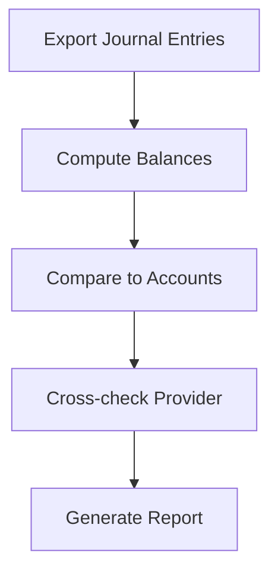

# Reconciliation Guide

**Version:** 1.0.0
**Last Updated:** 2025-09-05

Steps to confirm wallet ledgers and tournament pools remain balanced.

## Ledger Reconciliation

1. Export `JournalEntry` rows for the period grouped by account.
2. Compute running balances from debits and credits.
3. Compare computed balances with the `Account.balance` column.
4. Cross‑check totals against provider statements.
5. Archive a report highlighting any deltas and investigate mismatches immediately.

## Buy‑ins and Payouts

- Buy‑ins debit the player and credit the event pool.
- Payouts debit the pool and credit winners.
- Rake credits the house before payouts are distributed.

## Dispute Workflow

1. Support logs a ticket with account id, timeframe and evidence.
2. Operations replays entries and verifies provider transactions.
3. If ledger is correct, communicate findings; otherwise write correcting entries.
4. Escalate unresolved cases to compliance.

## Audit Trail

All reconciliation runs and dispute outcomes are archived under `storage/` with
immutable timestamps and SHA‑256 checksums.

