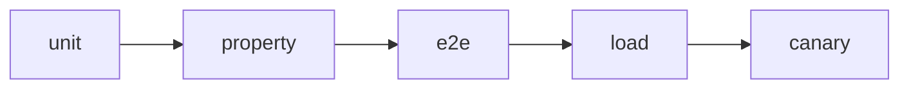

# Integration Test Flow

These end-to-end tests exercise the full stack using real services.

## CI pipeline



## Running locally

```bash
# start backend, redis, and frontend containers
docker compose -f docker-compose.yml -f docker-compose.test.yml up -d

# run the Playwright suite
cd frontend
npm run test:e2e:integration
```

The tests will:

1. Log in through the UI.
2. Join a poker table and play a hand.
3. Observe `hand.start` and `hand.end` events over WebSocket.
4. Fetch `/tables` and validate the response against shared Zod types.
5. Fetch `/hands/{id}/proof` and verify the RNG commit–reveal hash.

If the API schema changes, Zod parsing fails and the tests fail,
ensuring contract mismatches are caught. Proofs from each run are
written to `frontend/test-results/` for audit.

## Contract version guard

During `prebuild`, the frontend imports `API_CONTRACT_VERSION` from
`@shared/constants` and queries the backend's `/status` endpoint. If
the advertised major versions differ, the build exits with an error so
integration tests never run against an incompatible API.

## Authenticated API helper

Use the `apiClient` helper (`frontend/src/lib/api/client.ts`) for authenticated
requests in tests. It automatically includes cookies and the current JWT from
the auth store:

```ts
import { apiClient } from '@/lib/api/client';
import { LeaderboardResponseSchema } from '@shared/types';

await apiClient('/api/leaderboard', LeaderboardResponseSchema);
```

## WebSocket load test

A k6 scenario under `load/` drives more than 10k sockets against the `/game`
namespace and records ACK latency. Run it against the local stack:

```bash
# with services already up via docker compose
docker compose -f docker-compose.yml -f docker-compose.test.yml run --rm load
```

Results are written to `load/ack-summary.json` and include p95/p99 latency
and ACK drop rate. Thresholds are encoded in the script so the command fails
when latency exceeds 200 ms p95, 400 ms p99, or the success rate drops below 99%.

## Shutdown

```bash
docker compose -f docker-compose.yml -f docker-compose.test.yml down -v
```
