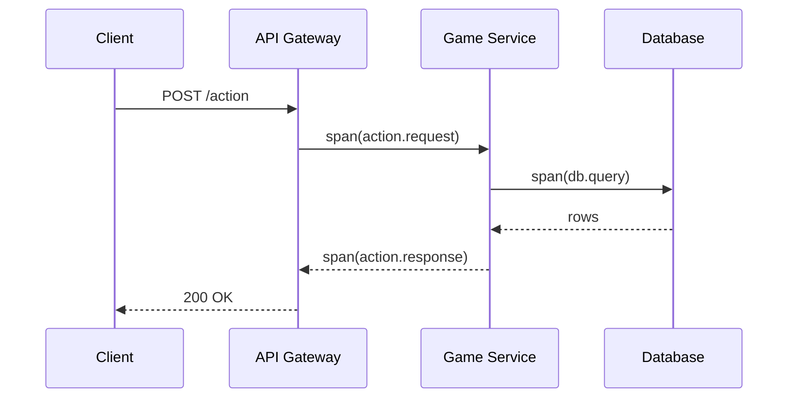
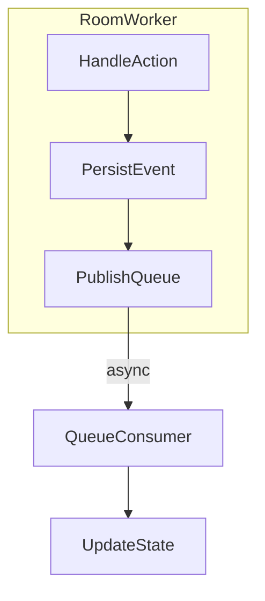

# Observability Load Tests

This guide covers running high rate action tests with network faults and surfacing metrics.

## Prerequisites
- Docker
- [`k6`](https://k6.io) binary
- [`toxiproxy-cli`](https://github.com/Shopify/toxiproxy)

## Start observability stack
```sh
docker run -d --name toxiproxy -p 8474:8474 -p 3001:3001 ghcr.io/shopify/toxiproxy
# Prometheus scrapes k6's built-in endpoint
cp load/prometheus.yml ./prometheus.yml
docker run -d --name prom -p 9090:9090 -v $(pwd)/prometheus.yml:/etc/prometheus/prometheus.yml prom/prometheus
# Grafana for dashboards
docker run -d --name grafana -p 3000:3000 grafana/grafana
```

## Inject packet loss and jitter
Configure a websocket proxy with 5% packet loss and 50 ms jitter:
```sh
./load/toxiproxy.sh
```
The application should connect to `ws://localhost:3001` to pass through the proxy.

## Run the k6 action flood
```sh
k6 run --vus 50 --duration 1m --out prometheus load/k6-table-actions.js
```
The script spawns ~180 actions/min per table and exports the `ack_latency` metric with an SLO of p95 <500 ms.

## Dashboards
- Prometheus UI: <http://localhost:9090>
- Grafana UI: <http://localhost:3000> (import `load/grafana-ack-latency.json`)

### Stake Level Metrics

The nightly analytics job populates ClickHouse tables with stake-level VPIP,
PFR, average pot size, and average action latency. Example queries:

```sql
SELECT * FROM stake_vpip ORDER BY stake;
SELECT * FROM stake_pfr ORDER BY stake;
SELECT * FROM stake_pot ORDER BY stake;
SELECT * FROM stake_action_latency ORDER BY stake;
```

Import `load/grafana-stake-metrics.json` into Grafana to visualize these
aggregates and receive alerts when thresholds are crossed.

### Player Analytics

Import `infrastructure/observability/player-analytics-dashboard.json` into
Grafana for DAU/MAU trends, rake curves, and stake-level VPIP/PFR/Pot
visualizations. Metabase cards for the same metrics live in
`infrastructure/observability/metabase-dashboard.json`.

## OpenTelemetry
Metrics can also be shipped via OTLP:
```sh
k6 run --vus 50 --duration 1m --out otlp --otlp-endpoint http://localhost:4318 load/k6-table-actions.js
```

### Example Trace Diagrams





## Production Dashboards & Alerts


The Grafana SLO dashboard tracks HTTP API p99 latency, WebSocket p95 latency,
action ACK p95 latency, wallet transaction throughput, and service availability.
Prometheus evaluates these objectives and sends violations to the
`pokerhub-sre` PagerDuty service.

See [SLOs](SLOs.md) for targets and [error-budget procedures](error-budget-procedures.md) for freeze and rollback rules. Individual metric runbooks under [runbooks/](runbooks/) provide dashboard and PagerDuty escalation details.


## Rate Limit Alerts

The backend exports counters for `per_socket_limit_exceeded` and
`global_limit_exceeded`.  Prometheus should alert when either limit is
consistently above 5% of total actions over a 5‑minute window:

```promql
sum(rate(per_socket_limit_exceeded[5m])) / sum(rate(game_action_global_count[5m])) > 0.05
```

```promql
sum(rate(global_limit_exceeded[5m])) / sum(rate(game_action_global_count[5m])) > 0.05
```

These rules detect sustained rate limiting and notify operators to
investigate upstream load or misbehaving clients.

## Prometheus Metrics

The backend's telemetry module exposes Prometheus metrics on
`http://localhost:9464/metrics`. A scrape job similar to the one below feeds
those metrics into Prometheus:

```yaml
scrape_configs:
  - job_name: pokerhub-backend
    static_configs:
      - targets: ['backend:9464']
```

## Burn Rate Alerts

Alertmanager evaluates latency and request error SLOs using fast (1 h) and
slow (6 h) burn rate windows. These rules live under
`infrastructure/prometheus/alerts.yml`:

```yaml
groups:
  - name: pokerhub-slo-burn
    rules:
      - alert: LatencySLOBurnRate1h
        expr: latency_error_budget_burn_rate_1h > 14.4
        for: 2m
      - alert: LatencySLOBurnRate6h
        expr: latency_error_budget_burn_rate_6h > 6
        for: 15m
      - alert: ErrorRateSLOBurnRate1h
        expr: request_error_budget_burn_rate_1h > 14.4
        for: 2m
      - alert: ErrorRateSLOBurnRate6h
        expr: request_error_budget_burn_rate_6h > 6
        for: 15m
```

Each rule routes to the `pokerhub-sre` PagerDuty service when the error budget
is consumed too quickly.

