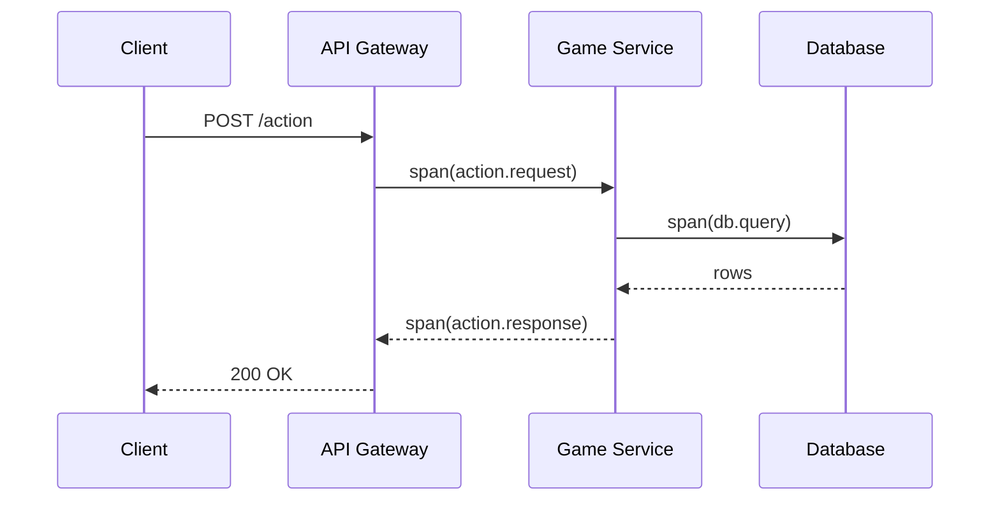
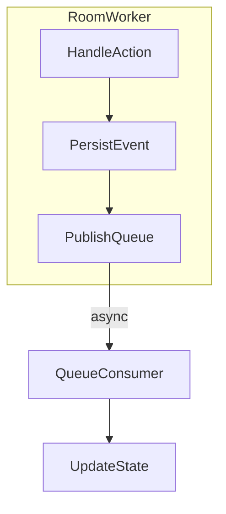
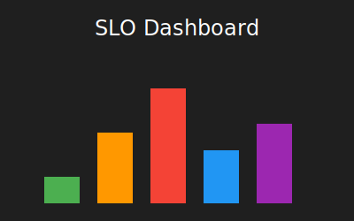

# Observability Load Tests

This guide covers running high rate action tests with network faults and surfacing metrics.

## Prerequisites
- Docker
- [`k6`](https://k6.io) binary
- [`toxiproxy-cli`](https://github.com/Shopify/toxiproxy)

## Start observability stack
```sh
docker run -d --name toxiproxy -p 8474:8474 -p 3001:3001 ghcr.io/shopify/toxiproxy
# Prometheus scrapes k6's built-in endpoint
cp load/prometheus.yml ./prometheus.yml
docker run -d --name prom -p 9090:9090 -v $(pwd)/prometheus.yml:/etc/prometheus/prometheus.yml prom/prometheus
# Grafana for dashboards
docker run -d --name grafana -p 3000:3000 grafana/grafana
```

## Inject packet loss and jitter
Configure a websocket proxy with 5% packet loss and 50 ms jitter:
```sh
./load/toxiproxy.sh
```
The application should connect to `ws://localhost:3001` to pass through the proxy.

## Run the k6 action flood
```sh
k6 run --vus 50 --duration 1m --out prometheus load/k6-table-actions.js
```
The script spawns ~180 actions/min per table and exports the `ack_latency` metric with an SLO of p95 <500 ms.

## Dashboards
- Prometheus UI: <http://localhost:9090>
- Grafana UI: <http://localhost:3000> (import `load/grafana-ack-latency.json`)

### GC Pause & Heap Growth

Run `load/collect-gc-heap.sh` alongside the soak test to sample
`process.memoryUsage()` and event‑loop lag.  In Grafana, create panels with the
following Prometheus queries to visualize these samples:

- p95 GC pause: `histogram_quantile(0.95, rate(nodejs_gc_duration_seconds_bucket[5m]))`
- Heap used bytes: `nodejs_heap_size_used_bytes`

The soak harness logs these values and exits non‑zero if heap usage grows by
more than 1 % or if the p95 GC pause exceeds 50 ms.

### Stake Level Metrics

The nightly analytics job populates ClickHouse tables with stake-level VPIP,
PFR, average pot size, and average action latency. Example queries:

```sql
SELECT * FROM stake_vpip ORDER BY stake;
SELECT * FROM stake_pfr ORDER BY stake;
SELECT * FROM stake_pot ORDER BY stake;
SELECT * FROM stake_action_latency ORDER BY stake;
```

Import `load/grafana-stake-metrics.json` into Grafana to visualize these
aggregates and receive alerts when thresholds are crossed.

### Player Analytics

Import `infra/observability/player-analytics-dashboard.json` into
Grafana for DAU/MAU trends, rake curves, and stake-level VPIP/PFR/Pot
visualizations. Metabase cards for the same metrics live in
`infra/observability/metabase-dashboard.json`.

## OpenTelemetry
Metrics can also be shipped via OTLP:
```sh
k6 run --vus 50 --duration 1m --out otlp --otlp-endpoint http://localhost:4318 load/k6-table-actions.js
```

## Backend Telemetry

The backend `LoggingModule` boots OpenTelemetry through an `OtelProvider` that
configures the NodeSDK with OTLP trace and metric exporters as well as a
Prometheus scrape endpoint.  Instrumentations for Redis, Postgres and Socket.IO
are enabled so traces span cache calls, database queries and WebSocket message
handlers.

Exporter endpoints are driven by environment variables:

```
OTEL_EXPORTER_OTLP_ENDPOINT=http://collector:4318/v1/traces
OTEL_EXPORTER_OTLP_METRICS_ENDPOINT=http://collector:4318/v1/metrics
OTEL_EXPORTER_PROMETHEUS_PORT=9464
```

Shutting down the Nest application triggers the provider to gracefully flush
and stop the SDK.

### Example Trace Diagrams





## Production Dashboards & Alerts



The Grafana SLO dashboard tracks:

- HTTP API p99 latency – <https://grafana.pokerhub.example/d/http-api-latency> (`pokerhub-sre`)
- WebSocket p95 latency – <https://grafana.pokerhub.example/d/websocket-latency> (`pokerhub-sre`)
- Action ACK p95 latency – <https://grafana.pokerhub.example/d/socket-latency> (`pokerhub-sre`)
- Socket connect success – <https://grafana.pokerhub.example/d/socket-connects> (`pokerhub-sre`)
- Request error rate – <https://grafana.pokerhub.example/d/error-rates> (`pokerhub-sre`)
- Queue saturation – <https://grafana.pokerhub.example/d/queue-saturation> (`pokerhub-eng`)
- Frontend route latency – <https://grafana.pokerhub.example/d/frontend-route-latency> (`pokerhub-eng`)
- Service availability – <https://grafana.pokerhub.example/d/service-uptime> (`pokerhub-sre`)

Prometheus evaluates these objectives and sends violations to the
`pokerhub-sre` PagerDuty service.

See [SLOs](SLOs.md) for targets and [error-budget procedures](error-budget-procedures.md) for freeze and rollback thresholds. Import `infra/observability/alerts-overview-grafana.json` for a Grafana summary of active burn rates, or `infra/observability/alerts-overview-metabase.json` for a Metabase view of the same data.

Production deployments expose these views at:

- Grafana SLO overview: <https://grafana.pokerhub.example/d/slo/slo-overview>
- Metabase Alerts Overview: <https://metabase.pokerhub.example/dashboard/42-alerts>
- PagerDuty escalation policies:
  - SRE: <https://pokerhub.pagerduty.com/escalation_policies/PABC123>
  - Engineering: <https://pokerhub.pagerduty.com/escalation_policies/PDEF456>
  - Ops: <https://pokerhub.pagerduty.com/escalation_policies/PGHI789>

### Runbooks

Individual metric runbooks provide dashboard links and PagerDuty escalation details. See the [runbook index](runbooks/index.md) for the full list:

- [HTTP API Latency](runbooks/http-api-latency.md) ([Grafana JSON](../infra/observability/http-api-latency-dashboard.json))
- [WebSocket Latency](runbooks/websocket-latency.md) ([Grafana JSON](../infra/observability/websocket-latency-dashboard.json))
- [Action ACK Latency](runbooks/action-ack-latency.md) ([Grafana JSON](../infra/observability/socket-latency-dashboard.json))
- [Wallet Throughput](runbooks/wallet-throughput.md) ([Grafana JSON](../infra/observability/wallet-throughput-dashboard.json))
- [Socket Connect Success](runbooks/socket-connect-success.md) ([Grafana JSON](../infra/observability/socket-connects-dashboard.json))
- [Error Rates](runbooks/error-rates.md) ([Grafana JSON](../infra/observability/error-rates-dashboard.json))
- [Service Uptime](runbooks/service-uptime.md) ([Grafana JSON](../infra/observability/service-uptime-dashboard.json))
- [Queue Saturation](runbooks/queue-saturation.md) ([Grafana JSON](../infra/observability/queue-lag-dashboard.json))
- [Telemetry Pipeline](runbooks/telemetry-pipeline.md) ([Grafana JSON](../infra/observability/latency-error-resource-dashboard.json))
- [Security Incident Response](security/incident-response.md)


## Rate Limit Alerts

The backend exports counters for `per_socket_limit_exceeded` and
`global_limit_exceeded`.  Prometheus should alert when either limit is
consistently above 5% of total actions over a 5‑minute window:

```promql
sum(rate(per_socket_limit_exceeded[5m])) / sum(rate(game_action_global_count[5m])) > 0.05
```

```promql
sum(rate(global_limit_exceeded[5m])) / sum(rate(game_action_global_count[5m])) > 0.05
```

These rules detect sustained rate limiting and notify operators to
investigate upstream load or misbehaving clients.

## Prometheus Metrics

The backend's telemetry module exposes Prometheus metrics on
`http://localhost:9464/metrics`. A scrape job similar to the one below feeds
those metrics into Prometheus:

```yaml
scrape_configs:
  - job_name: pokerhub-backend
    static_configs:
      - targets: ['backend:9464']
```

## Burn Rate Alerts

Alertmanager evaluates latency and request error SLOs using fast (1 h) and
slow (6 h) burn rate windows. These rules live under
`infra/prometheus/alerts.yml`:

```yaml
groups:
  - name: pokerhub-slo-burn
    rules:
      - alert: LatencySLOBurnRate1h
        expr: latency_error_budget_burn_rate_1h > 14.4
        for: 2m
      - alert: LatencySLOBurnRate6h
        expr: latency_error_budget_burn_rate_6h > 6
        for: 15m
      - alert: ErrorRateSLOBurnRate1h
        expr: request_error_budget_burn_rate_1h > 14.4
        for: 2m
      - alert: ErrorRateSLOBurnRate6h
        expr: request_error_budget_burn_rate_6h > 6
        for: 15m
```

Each rule routes to the `pokerhub-sre` PagerDuty service when the error budget
is consumed too quickly.

