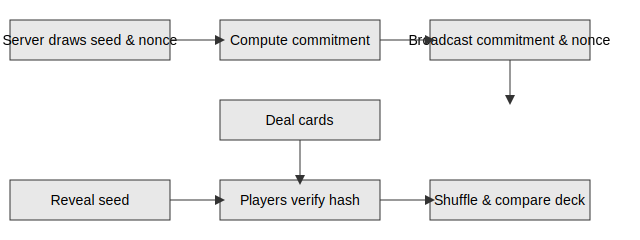

# RNG Whitepaper

**Version:** 1.0.0
**Last Updated:** 2025-10-04

PokerHub uses a commit–reveal protocol to prove every shuffle was fair and unmanipulated.

## Commit–Reveal Flow



1. The server draws a random seed and nonce and commits to their hash.
2. The commitment and nonce are broadcast before cards are dealt.
3. After the hand, the seed is revealed so anyone can reproduce the shuffle.

## Commit Phase
- Server draws a 32‑byte seed and 16‑byte nonce using Google Cloud's Cloud RNG exposed through `crypto.randomBytes`.
- It computes `commitment = sha256(seed || nonce)`.
- The commitment and nonce are broadcast to all seats and logged before any cards are dealt.

## Reveal Phase
- After the hand ends, the seed is published.
- Anyone can recompute `sha256(seed || nonce)` to confirm it matches the original commitment.
- Using the revealed seed, a Fisher–Yates shuffle reproduces the deterministic deck order.

## Verification Steps
1. Fetch `{ seed, nonce, commitment }` from `/hands/{id}/proof`.
2. Verify the hash equality.
3. Shuffle a new deck with the seed and compare against the public hand log.
4. Optional: run `bin/verify-hand <handId>` to automate steps 1–3.

### Verifying Proofs via GCS
Players can independently validate a hand using the public Google Cloud Storage bucket:

1. Download the proof JSON:

   ```sh
   gsutil cp gs://pokerhub-proofs/<handId>.json proof.json
   ```

2. Run the verifier with the downloaded values:

   ```sh
   npx ts-node shared/verify/index.ts $(jq -r '.seed' proof.json) \
     $(jq -r '.nonce' proof.json) $(jq -r '.commitment' proof.json)
   ```

The verifier recomputes the commitment and deterministic deck to confirm fairness.

### Sample Verification Proof

For hand `h1` the server published:

```json
{ "seed": "0x7e3", "nonce": "0xa9", "commitment": "0x5b2f..." }
```

Recomputing `sha256(seed || nonce)` yields `0x5b2f...`, matching the commitment and proving the shuffle was bound to that seed.

## Security Guarantees
- Players know the deck order could not be altered post‑deal.
- Observers can archive proofs for independent audits.
- Any mismatch between the commitment and revealed seed proves tampering.

## Audit Proofs
- Every hand stores `{seed, nonce, commitment}` in an append-only log that is hashed into a nightly Merkle root.
- The root is timestamped and signed with the server's Ed25519 key so regulators can verify provenance.
- An open-source verifier script reproduces the shuffle and validates the signed Merkle proof against the public key.
- Proofs are published to a public GCS bucket (`gs://pokerhub-proofs/`) for long-term archival and community audits.

## Audit Methodology

Our RNG undergoes yearly reviews using the NIST SP 800‑22 battery and dieharder suites.  Methodology and tooling are detailed in [Security RNG Fairness](../security/rng-fairness.md).

## Seed Management Policy
- Seeds originate from a hardware RNG and are kept only in process memory until reveal.
- After a hand concludes the seed is persisted for **30 days** in encrypted storage for dispute resolution and then shredded.
- Access to historical seeds requires two-person approval and is audited by the security team.

## See Also
- [RNG Fairness Spec](../rng-fairness.md)
- [Collusion Review Runbook](../runbooks/collusion-review.md)

## Revision History
- 2025-10-04: document audit proofs, seed retention policy, and version metadata
- 2025-08-30: add commit–reveal diagram and flow summary
- 2025-01-04: initial public release
