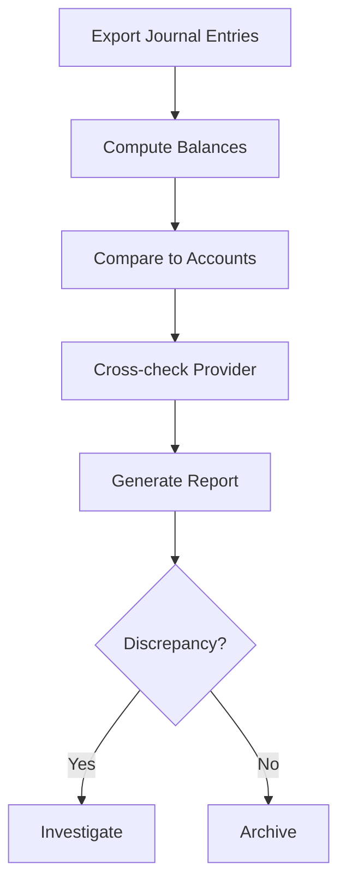

# Reconciliation Guide

**Version:** 1.0.0  
**Last Updated:** 2025-08-30

This guide explains how wallet ledgers stay consistent and how disputes are resolved.

## Ledger Reconciliation

1. Export all `JournalEntry` rows for the period and sort by account and timestamp.
2. Compute a running balance per account using debits and credits.
3. Compare the computed balance with the `accounts.balance` column.
4. Cross‑check totals against payment provider statements.
5. Generate a daily report highlighting any deltas and archive it.
6. Investigate mismatches immediately; no gambling funds are released until resolved.

### Flow

## Failure Scenarios

| Scenario | Detection | Resolution |
|---------|-----------|------------|
| Missing journal entry | Running balance differs from provider report | Insert corrective entry and document root cause. |
| Double debit/credit | Duplicate reference IDs in `JournalEntry` | Reverse duplicate and alert engineering. |
| Provider outage | API reconciliation fails | Pause withdrawals and retry reconciliation when service restores. |
| Crash mid‑reconciliation | Report generation incomplete | Rerun reconciliation from last successful checkpoint. |

### Example Mismatch

Deposit provider reports $50, but journal shows $40 credit. Create a $10 corrective entry and note the discrepancy.

## Dispute Workflow

1. **Intake** – Support logs a ticket with account id, timeframe, and evidence.
2. **Triaging** – Operations replays journal entries and verifies provider transactions.
3. **Resolution** – If ledger is correct, communicate findings; otherwise write correcting entries.
4. **Escalation** – Unresolved cases escalate to compliance for regulatory reporting.

## Audit Trail

- All reconciliation runs and dispute outcomes are archived under `storage/` with immutable timestamps.
- Reports older than one year move to cold storage but remain retrievable for regulators.

## Revision History
- 2025-08-30: add reconciliation flow diagram, example mismatch, and version metadata

