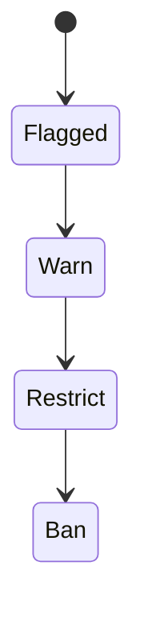

# Security Threat Model

This document outlines the STRIDE threat model for PokerHub.

## Review State Diagram



## Message Schemas

### `FlaggedSession`

```json
{
  "id": "uuid",
  "users": ["uuid"],
  "status": "flagged | warn | restrict | ban"
}
```

### `ReviewAction`

```json
{
  "action": "warn | restrict | ban"
}
```

## Spoofing
- Enforce strong authentication with short-lived JWTs and refresh token rotation.
- Same-site, HTTP-only cookies prevent credential reuse across sites.

## Tampering
- Helmet sets Content-Security-Policy and HSTS headers to protect against script injection and downgrade attacks.
- All wallet movements are recorded as immutable journal entries.

## Repudiation
- Transaction logs and span tracing provide non-repudiation for wallet operations.

## Information Disclosure
- Strict CSP reduces risk of data exfiltration.
- Geo-fencing and sanctions checks block access from high-risk regions.

## Denial of Service
- Velocity limits on deposits and withdrawals throttle abusive clients.
- Redis-backed rate limiting on authentication endpoints blocks brute-force attempts.

## Elevation of Privilege
- KYC verification and sanctions screening prevent prohibited users from accessing funds.

## Incident Triage Workflow
1. Automated detectors flag anomalies and collusion signals.
2. Review flagged sessions via the admin dashboard and correlate with logs.
3. Escalate confirmed incidents to the security team for deeper analysis.
4. Document findings and track them through resolution.

## Mitigation Steps
- Restrict or ban offending accounts using the review APIs.
- Invalidate active sessions and rotate credentials when compromise is suspected.
- Apply rate limits or temporary table locks to contain live attacks.
- Update analytics rules and monitoring thresholds based on post-mortem lessons.

