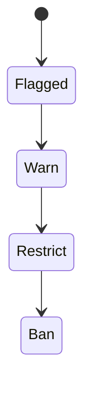

# Security Threat Model

This document outlines the STRIDE threat model for PokerHub.

## Review State Diagram



## Message Schemas

### `FlaggedSession`

```json
{
  "id": "uuid",
  "users": ["uuid"],
  "status": "flagged | warn | restrict | ban"
}
```

### `ReviewAction`

```json
{
  "action": "warn | restrict | ban"
}
```

## Spoofing

### Threats
- Stolen credentials allow attackers to pose as legitimate users.
- Replayed session tokens let adversaries hijack active games.
- Social engineering could trick support staff into granting elevated access.

## System Modules

### Backend
- **Auth Service** – issues and validates player sessions.
- **Game Engine** – runs tables, enforces rules and records actions.
- **Wallet/Payments** – processes deposits, withdrawals and balance updates.
- **Analytics** – ingests game events and executes collusion queries.
- **Admin API** – exposes review and enforcement endpoints.

### Frontend
- **Auth Pages** – collect credentials and store tokens.
- **Lobby** – lists tables and tournaments fetched from the API.
- **Table Client** – sends actions to the game engine and renders results.
- **Account & Wallet** – manage profile details and transactions.
- **Admin Dashboard** – surfaces collusion alerts and allows actions.

## Data Flows
- **Login**: Auth Page → Auth Service → session token → stored in browser.
- **Gameplay**: Table Client → Game Engine → updates → Table Client; events → Analytics.
- **Payments**: Wallet UI → Wallet Service → payment processor → Wallet Service → UI update.
- **Collusion Review**: Admin Dashboard → Admin API → Analytics/Collusion services → dashboard updates.

### Mitigations
- Enforce strong authentication with short-lived JWTs and refresh token rotation using a Redis-backed revocation list to block replayed tokens.
- JWT signing keys rotate regularly and the service accepts multiple active keys to allow seamless key rollover.
- Same-site, HTTP-only cookies prevent credential reuse across sites.
- Admin actions require MFA and hardware-backed keys to resist phishing.
**Risk Rating:** High

## Tampering

### Threats
- Attackers may alter client requests or intercept responses.
- Malicious insiders could modify financial records.

### Mitigations
- Global middleware sets Content-Security-Policy, HSTS and SameSite cookie headers to protect against script injection and downgrade attacks.
- All wallet movements are recorded as immutable journal entries.
- Git commits are signed and CI verifies checksums on static assets.
**Risk Rating:** Medium

## Repudiation

### Threats
- Players might deny placing specific bets or performing chip transfers.
- Operators may need to prove actions in regulatory disputes.

### Mitigations
- Transaction logs and span tracing provide non-repudiation for wallet operations.
- Audit trails include user IDs, timestamps and request hashes for every sensitive operation.
**Risk Rating:** Medium

## Information Disclosure

### Threats
- Leakage of hand histories or personal data could give unfair advantages.
- Side-channel timing attacks might reveal card order.

### Mitigations
- Strict CSP reduces risk of data exfiltration.
- Geo-fencing and sanctions checks block access from high-risk regions.
- TLS 1.3 with perfect forward secrecy protects data in transit and ALB access logs are redacted of PII.
**Risk Rating:** High

## Denial of Service

### Threats
- Bots could overwhelm lobbies or wallet APIs to make the site unusable.
- Targeted resource exhaustion could starve table workers.

### Mitigations
- Velocity limits on deposits and withdrawals throttle abusive clients.
- Redis-backed rate limiting on authentication endpoints blocks brute-force attempts.
- Circuit breakers shed load and auto-scale policies add capacity during bursts.
**Risk Rating:** Medium

## Elevation of Privilege

### Threats
- Logic bugs may grant standard users administrative powers.
- Compromised dependencies might execute with elevated permissions.

### Mitigations
- KYC verification and sanctions screening prevent prohibited users from accessing funds.
- Role-based access control validates tokens on every request and sensitive services run in least-privilege containers.
**Risk Rating:** High

## Incident Triage Workflow
1. Automated detectors flag anomalies and collusion signals.
2. Review flagged sessions via the admin dashboard and correlate with logs.
3. Escalate confirmed incidents to the security team for deeper analysis.
4. Document findings and track them through resolution.

## Mitigation Steps
- Restrict or ban offending accounts using the review APIs.
- Invalidate active sessions and rotate credentials when compromise is suspected.
- Apply rate limits or temporary table locks to contain live attacks.
- Update analytics rules and monitoring thresholds based on post-mortem lessons.


## Security Scan Remediation
- Nightly OWASP ZAP baseline scans run against the dev deployment.
- The CI job fails on any ASVS L2 or high/critical alerts.
- Remediation workflow:
  1. Review the `zap-report.json` artifact to pinpoint the offending alert.
  2. Fix the vulnerability in code or configuration.
  3. Re-run the security scan to verify the issue is resolved.
  4. Document the incident and mitigation in the security backlog.

