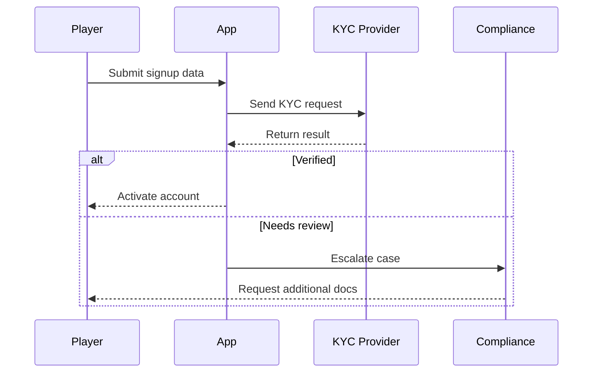
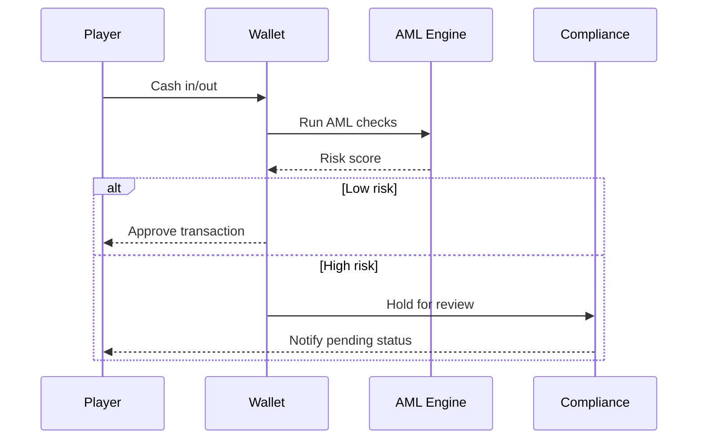
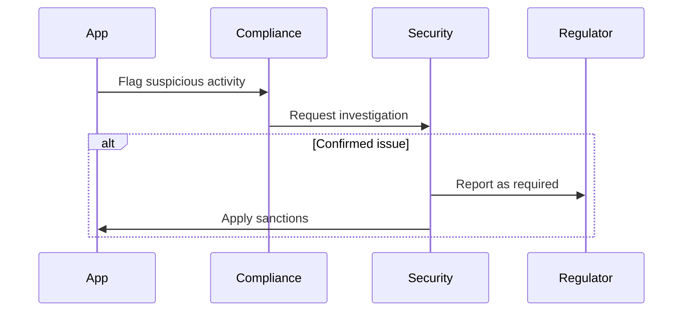

# KYC / AML Flow

PokerHub requires identity verification and anti-money-laundering checks during player onboarding.

## Onboarding Checks
1. Collect legal name, date of birth, and address.
2. Verify identity documents through the provider API.
3. Require selfie match when risk score exceeds threshold.

## Sanctions Screening
- Screen players against global sanctions and politically exposed person lists on every signup.
- Re-run screening nightly for existing accounts and lock matches pending review.

## Audit Logging
- Record all verification requests and provider responses with timestamps and reviewer IDs.
- Retain logs for seven years in immutable storage for regulatory audits.

## Escalation Steps
1. Flagged signups or transactions enter a manual review queue within 24 hours.
2. Compliance reviews evidence and either approves, requests additional documents, or marks the account high risk.
3. High-risk cases escalate to the security team for deeper investigation.
4. Confirmed suspicious activity triggers a Suspicious Activity Report to regulators and immediate account freeze.

## Sequence Diagrams

### Onboarding

### Verification

### Escalation

