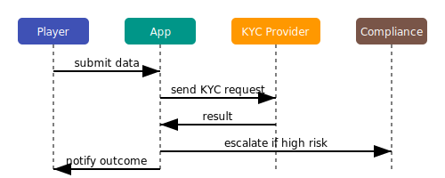
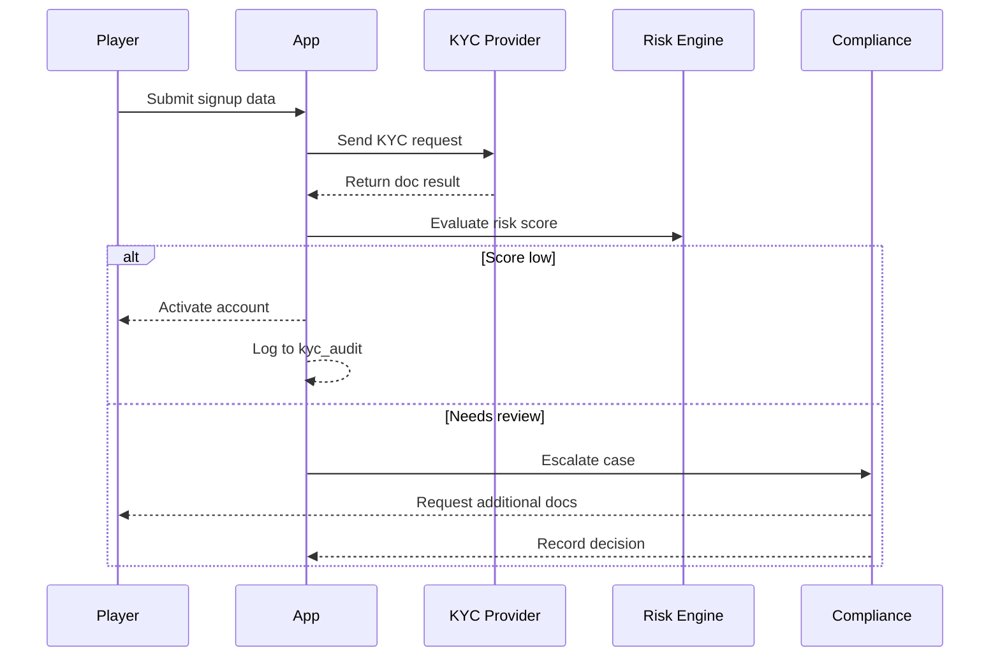
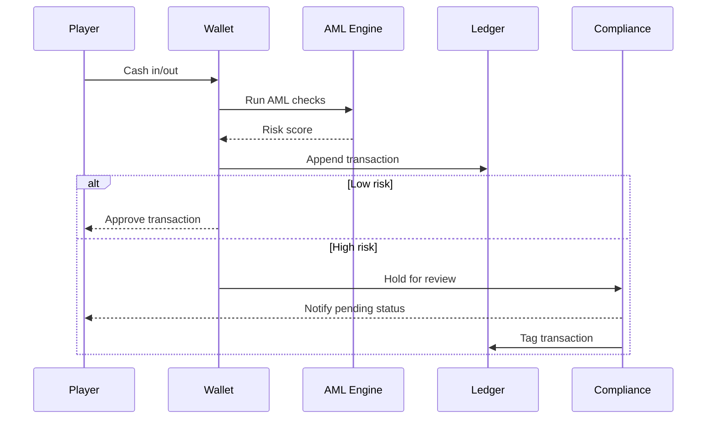
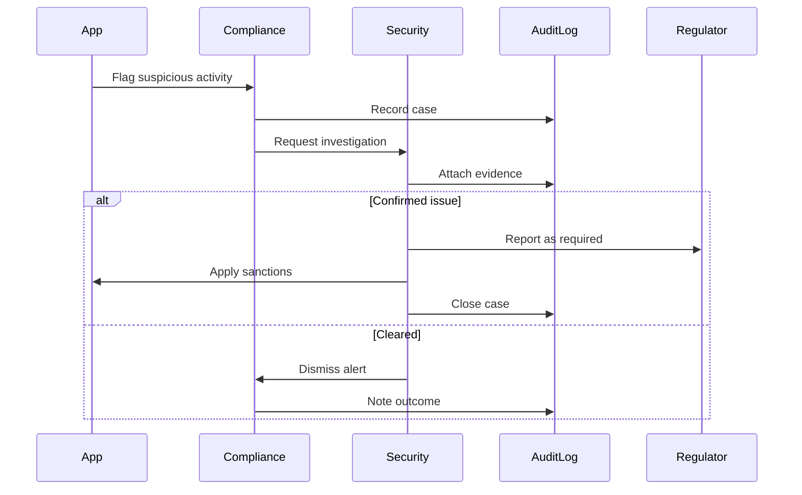

# KYC / AML Flow

PokerHub requires identity verification and anti-money-laundering checks during player onboarding.

## Overview



## Onboarding Checks
1. Collect legal name, date of birth, and address.
2. Verify identity documents through the provider API.
3. Require selfie match when risk score exceeds threshold.

## Example API Payloads

### KYC Request

```json
POST /wallet/u123/kyc
{
  "name": "Ada Lovelace",
  "dob": "1990-12-10",
  "address": {
    "line1": "1 Blockchain Way",
    "city": "Valletta",
    "country": "MT"
  }
}
```

### Provider Callback

```json
{
  "requestId": "req-9c2",
  "status": "approved",
  "reference": "OF-88122"
}
```

### AML Transaction Check

Triggered during withdrawals:

```json
POST /wallet/u123/withdraw
{
  "amount": 2500,
  "deviceId": "dev-9c2",
  "currency": "USD"
}
```

## Sanctions Screening
- Screen players against global sanctions and politically exposed person lists on every signup.
- Re-run screening nightly for existing accounts and lock matches pending review.

## Audit Logging
- Record all verification requests and provider responses with timestamps and reviewer IDs.
- Each step writes to a `kyc_audit` table capturing user ID, request ID, source IP and decision metadata for traceability.
- Hash document numbers and redact sensitive fields before persistence.
- Retain logs for seven years in immutable storage for regulatory audits.

### Audit Table Schema

```sql
CREATE TABLE kyc_audit (
  id SERIAL PRIMARY KEY,
  user_id UUID NOT NULL,
  request_id TEXT NOT NULL,
  source_ip INET NOT NULL,
  decision TEXT NOT NULL,
  reviewer_id UUID,
  created_at TIMESTAMPTZ DEFAULT now()
);
```

```sql
CREATE TABLE aml_audit (
  id SERIAL PRIMARY KEY,
  user_id UUID NOT NULL,
  tx_id TEXT NOT NULL,
  score NUMERIC NOT NULL,
  reviewer_id UUID,
  created_at TIMESTAMPTZ DEFAULT now()
);
```

## Provider Error Handling

- Network failures or non-2xx responses from the verification provider are retried with exponential backoff. After three failed attempts the circuit breaker in [kyc.service.ts](../../backend/src/common/kyc.service.ts) opens and the request is marked failed.
- Provider callbacks with `rejected` or `error` statuses transition the verification to `failed` and notify compliance.
- AML provider errors during `POST /wallet/:id/withdraw` result in the transaction being held and logged for manual review in [wallet.service.ts](../../backend/src/wallet/wallet.service.ts).

## Backend Endpoints

- `POST /wallet/:id/kyc` – initiates verification ([wallet.controller.ts](../../backend/src/routes/wallet.controller.ts)).
- `POST /wallet/:id/withdraw` – runs AML checks before committing funds ([wallet.controller.ts](../../backend/src/routes/wallet.controller.ts)).
- `GET /wallet/:id/status` – fetches wallet, KYC and AML state ([wallet.controller.ts](../../backend/src/routes/wallet.controller.ts)).

## Verification Steps
1. Validate document authenticity and match to provided identity data.
2. Cross-check applicants against sanctions and PEP lists and record reference IDs.
3. Run duplicate account and geolocation risk checks.
4. Evaluate selfie/liveness checks when triggered by risk scoring.
5. Perform AML transaction monitoring for deposits and withdrawals.
6. Capture reviewer decision with timestamp, source IP, and reasoning.

## Data Retention
| Artifact | Retention | Storage |
| --- | --- | --- |
| KYC requests & responses | 7 years | Immutable object store |
| Sanctions screening results | 7 years | Immutable object store |
| Reviewer notes & decisions | 7 years | Encrypted database |
| Suspicious Activity Reports | 5 years | Encrypted archive |

### Retention Policies

- Logs are purged after retention windows via scheduled jobs in `backend/src/common/kyc.service.ts`.
- Immutable artifacts live in `storage/kyc/` with versioned buckets.

## Escalation Steps
1. Flagged signups or transactions enter a manual review queue within 24 hours.
2. Compliance reviews evidence and either approves, requests additional documents, or marks the account high risk.
3. High-risk cases escalate to the security team via the PagerDuty `SECURITY-INCIDENT` policy for deeper investigation.
4. Confirmed suspicious activity triggers a Suspicious Activity Report to regulators and immediate account freeze.

## Sequence Diagrams

### Onboarding



### Verification



### Escalation


