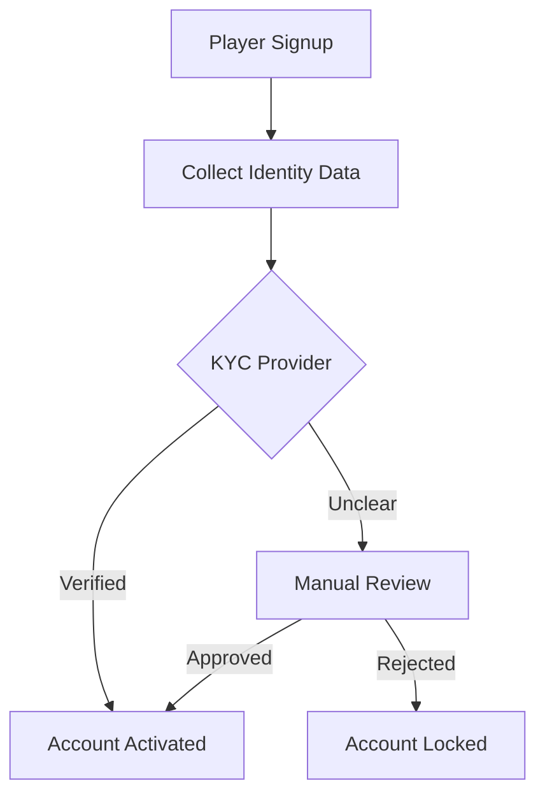
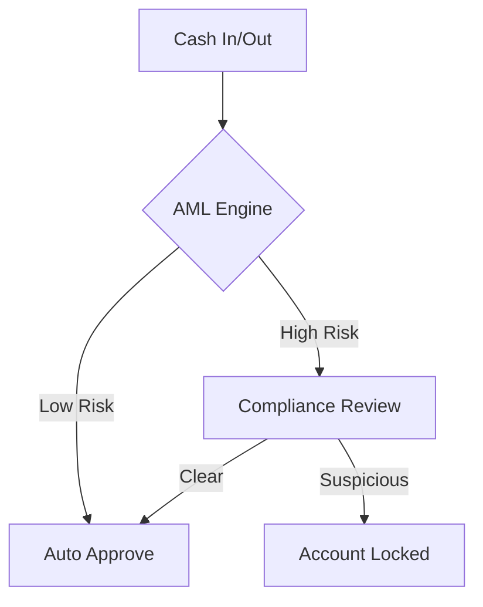

# KYC and AML Workflows

PokerHub integrates automated and manual checks to verify player identity and prevent money laundering.

Infrastructure workflow: see [`../../infra/analytics/kyc-aml-workflow.yaml`](../../infra/analytics/kyc-aml-workflow.yaml).

## Onboarding Workflow

## Transaction Monitoring

## Data Retention Policy
- **Identity Documents**: Stored encrypted for **7 years** after account closure.
- **KYC Provider Responses**: Retained for **7 years** in immutable logs.
- **Sanctions Screening Results**: Kept for **5 years** and revalidated nightly.
- **Transaction Histories**: Retained for **7 years** to satisfy AML regulations.
- **Manual Review Notes**: Retained for **5 years** with restricted access.

Sensitive data is encrypted at rest, access is logged, and deletion requests are honored once legal obligations expire.

