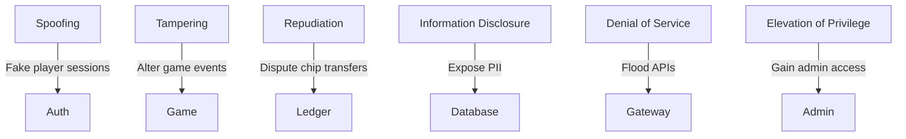

# Backend STRIDE Threat Model

This diagram highlights representative threats across PokerHub. The sections
below enumerate STRIDE threats and mitigations across all backend modules.

See [Incident Response Runbook](incident-response.md) for detection sources and escalation procedures.

## STRIDE Summary

| Category | Outcome | Runbook |
| --- | --- | --- |
| Spoofing | Fake player sessions | [Collusion Review](../runbooks/collusion-review.md) |
| Tampering | Altered data or configs | [Incident Procedures](../runbooks/incident-procedures.md) |
| Repudiation | Disputed transactions | [Wallet Reconciliation](../runbooks/wallet-reconciliation.md) |
| Information Disclosure | Exposed PII or secrets | [Incident Response](incident-response.md) |
| Denial of Service | Flooded APIs or resources | [Service Uptime](../runbooks/service-uptime.md) |
| Elevation of Privilege | Unauthorized admin access | [Incident Response](incident-response.md) |

## Component STRIDE Tables

### analytics
| Threat | Example | Mitigation |
| --- | --- | --- |
| Spoofing | Injecting fake telemetry events to skew metrics | Sign analytics payloads and accept events only from authenticated services |
| Tampering | Altering event metadata in transit | Use TLS and verify checksums before ingestion |
| Repudiation | Producers deny emitting certain metrics | Persist source service IDs and request hashes in immutable logs |
| Information Disclosure | Leaking sensitive player identifiers through analytics exports | Strip PII and apply access controls on dashboards |
| Denial of Service | Flooding analytics endpoint with high-volume noise | Rate-limit event ingestion and buffer through message queues |
| Elevation of Privilege | Gaining write access to analytics configuration | Restrict config endpoints to ops role and audit changes |

### collusion.service

Mitigations are detailed in [Anti-Collusion Monitoring](anti-collusion.md). See the [STRIDE Summary](stride-summary.md) for a consolidated view.

| Threat | Example | Mitigation |
| --- | --- | --- |
| Spoofing | Attackers submit fabricated sessions to hide real collusion | Require authenticated writes and verify session origins |
| Tampering | Manipulating evidence stored in Redis | Hash evidence and persist append-only logs |
| Repudiation | Players deny flagged behavior | Link feature payloads to session IDs and retain reviewer signatures |
| Information Disclosure | Evidence reveals relationships between users | Restrict access and scrub PII in analytics exports |
| Denial of Service | Flooding the service with bogus flags | Rate-limit APIs and bound Redis structures |
| Elevation of Privilege | Reviewers escalate states without audit | Enforce RBAC and audit trails on `applyAction` |

### auth
| Threat | Example | Mitigation |
| --- | --- | --- |
| Spoofing | Forging JWTs or session cookies | Use signed tokens with short TTLs and verify against JWKS |
| Tampering | Manipulating auth headers or callback parameters | Validate all inputs with shared schemas and enforce HTTPS |
| Repudiation | Users deny logins or privilege grants | Record login attempts with IP and device fingerprinting |
| Information Disclosure | Exposing password reset tokens or user secrets | Encrypt secrets at rest and mask tokens in logs |
| Denial of Service | Credential stuffing or login brute-force | Implement rate limits, CAPTCHA, and account lockouts |
| Elevation of Privilege | Bypassing RBAC to gain admin access | Server-side role checks and principle of least privilege |

### config
| Threat | Example | Mitigation |
| --- | --- | --- |
| Spoofing | Loading untrusted configuration sources | Only accept configs from signed bundles and verified paths |
| Tampering | Editing configuration files or environment variables | Store configs in read-only secrets manager and hash on load |
| Repudiation | Operators deny changing configuration | Track config versioning with commit history and audit logs |
| Information Disclosure | Leaking secrets through misconfigured files | Separate secrets from configs and restrict file access |
| Denial of Service | Pushing malformed configs causing crashes | Validate config schema before applying and support rollbacks |
| Elevation of Privilege | Changing feature flags to enable admin endpoints | Require signed approvals and review for privileged flags |

### database
| Threat | Example | Mitigation |
| --- | --- | --- |
| Spoofing | Impersonating database servers | Enforce TLS with certificate pinning |
| Tampering | Unauthorized modifications to records | Use role-based access and row-level permissions |
| Repudiation | Users dispute stored actions or balances | Append-only ledgers and transaction signatures |
| Information Disclosure | Dumping player data or credentials | Encrypt data at rest and restrict admin queries |
| Denial of Service | Expensive queries exhausting resources | Query timeouts, connection pooling, and throttling |
| Elevation of Privilege | Escalating to superuser via SQL injection | Parameterized queries and least-privileged DB roles |

### events
| Threat | Example | Mitigation |
| --- | --- | --- |
| Spoofing | Publishing forged domain events | Authenticate producers and sign messages |
| Tampering | Modifying events in the bus | Employ immutable logs and checksum verification |
| Repudiation | Producers deny sending critical events | Persist event provenance and timestamps |
| Information Disclosure | Exposing sensitive payloads to subscribers | Encrypt confidential fields and implement ACLs |
| Denial of Service | Event storms overwhelming consumers | Back-pressure and consumer quotas |
| Elevation of Privilege | Subscribing to unauthorized topics | Broker-level ACLs and service identity checks |

### feature-flags
| Threat | Example | Mitigation |
| --- | --- | --- |
| Spoofing | Fake flag service alters feature states | Require mTLS between flag service and clients |
| Tampering | Unauthorized flag toggles | Gate updates behind admin UI with audit logs |
| Repudiation | Operators deny changing a flag | Maintain versioned change history |
| Information Disclosure | Revealing upcoming features | Limit flag visibility by role and environment |
| Denial of Service | Flag service outage halts app startup | Cache flag states and provide sane defaults |
| Elevation of Privilege | Enabling hidden admin paths | Separate security-sensitive flags and require peer review |

### game
| Threat | Example | Mitigation |
| --- | --- | --- |
| Spoofing | Players forge game actions or state updates | Validate actions server-side and sign state transitions |
| Tampering | Manipulating game rules or RNG seeds | Store rules in code, hash RNG seeds, and verify integrity |
| Repudiation | Players dispute game outcomes | Record hand histories and RNG proofs |
| Information Disclosure | Revealing hidden cards or strategies | Encrypt in-transit data and segregate spectator views |
| Denial of Service | Flooding game engine with actions | Per-player rate limits and turn timers |
| Elevation of Privilege | Accessing privileged routes without proper auth | Centralized authorization middleware |

### gateway
| Threat | Example | Mitigation |
| --- | --- | --- |
| Spoofing | mTLS bypass between services and gateway | Enforce mTLS in [infrastructure/api-gateway/kong.yml](../../infrastructure/api-gateway/kong.yml) |
| Tampering | Modifying route handlers at runtime | Immutable deployments under [backend/src/routes](../../backend/src/routes) |
| Repudiation | Services deny invoking certain endpoints | Trace IDs in [backend/src/logging/providers/otel.provider.ts](../../backend/src/logging/providers/otel.provider.ts) |
| Information Disclosure | Exposing hidden admin routes | Require auth via [backend/src/routes/admin.controller.ts](../../backend/src/routes/admin.controller.ts) |
| Denial of Service | Route enumeration or heavy payloads | Rate limiting in [backend/src/auth/rate-limit.middleware.ts](../../backend/src/auth/rate-limit.middleware.ts) |
| Elevation of Privilege | Accessing privileged routes without proper auth | Centralized checks in [backend/src/auth/security.middleware.ts](../../backend/src/auth/security.middleware.ts) |

### schemas
| Threat | Example | Mitigation |
| --- | --- | --- |
| Spoofing | Using malicious schema definitions | Pin sources in [backend/src/schemas](../../backend/src/schemas) |
| Tampering | Changing schema validation rules | Code review in [backend/src/schemas](../../backend/src/schemas) |
| Repudiation | Developers deny schema changes | Commit history for [backend/src/schemas](../../backend/src/schemas) |
| Information Disclosure | Schemas reveal internal fields | Separate public files under [backend/src/schemas](../../backend/src/schemas) |
| Denial of Service | Complex schemas causing validation overhead | Benchmarks in [backend/src/schemas](../../backend/src/schemas) |
| Elevation of Privilege | Relaxed schemas allowing privilege escalation | Strict checks in [backend/src/schemas](../../backend/src/schemas) |

### scripts
| Threat | Example | Mitigation |
| --- | --- | --- |
| Spoofing | Running unauthorized maintenance scripts | Run signed utilities in [backend/src/scripts](../../backend/src/scripts) |
| Tampering | Modifying deployment scripts | Checksums enforced in [backend/src/scripts](../../backend/src/scripts) CI |
| Repudiation | Operators deny running scripts | Execution logs in [backend/src/scripts](../../backend/src/scripts) |
| Information Disclosure | Scripts outputting secrets | Redact output in [backend/src/scripts](../../backend/src/scripts) |
| Denial of Service | Faulty scripts consuming resources | Staged testing of [backend/src/scripts](../../backend/src/scripts) |
| Elevation of Privilege | Script misuse to escalate rights | Least‑privilege runners in [backend/src/scripts](../../backend/src/scripts) |

### session
| Threat | Example | Mitigation |
| --- | --- | --- |
| Spoofing | Hijacking session IDs | Rotate IDs in [backend/src/session/session.service.ts](../../backend/src/session/session.service.ts) bound to devices |
| Tampering | Altering session state | Server‑side storage in [backend/src/session/session.service.ts](../../backend/src/session/session.service.ts) |
| Repudiation | Users deny actions within a session | Audit logs via [backend/src/logging/providers/otel.provider.ts](../../backend/src/logging/providers/otel.provider.ts) |
| Information Disclosure | Session storage leaks | Encrypted store in [backend/src/session/session.service.ts](../../backend/src/session/session.service.ts) |
| Denial of Service | Session fixation or exhaustion | Limits in [backend/src/auth/rate-limit.middleware.ts](../../backend/src/auth/rate-limit.middleware.ts) |
| Elevation of Privilege | Session fixation leading to privilege gain | Token regeneration in [backend/src/session/session.service.ts](../../backend/src/session/session.service.ts) |

### storage
| Threat | Example | Mitigation |
| --- | --- | --- |
| Spoofing | Fake storage nodes supply data | Verify nodes in [backend/src/storage/gcs.service.ts](../../backend/src/storage/gcs.service.ts) |
| Tampering | Modifying stored files | Versioning in [backend/src/storage/gcs.service.ts](../../backend/src/storage/gcs.service.ts) |
| Repudiation | Operators deny file uploads or deletions | Audit trails from [backend/src/storage/gcs.service.ts](../../backend/src/storage/gcs.service.ts) |
| Information Disclosure | Public exposure of private assets | Signed URLs via [backend/src/storage/gcs.service.ts](../../backend/src/storage/gcs.service.ts) |
| Denial of Service | Excessive storage requests or large files | Quotas enforced in [backend/src/storage/gcs.service.ts](../../backend/src/storage/gcs.service.ts) |
| Elevation of Privilege | Gaining write access to protected buckets | IAM policies in [backend/src/storage/gcs.service.ts](../../backend/src/storage/gcs.service.ts) |

### telemetry
| Threat | Example | Mitigation |
| --- | --- | --- |
| Spoofing | Sending fake traces or metrics | Authenticated agents in [backend/src/telemetry/telemetry.ts](../../backend/src/telemetry/telemetry.ts) |
| Tampering | Altering telemetry payloads | TLS and checks in [backend/src/telemetry/telemetry.ts](../../backend/src/telemetry/telemetry.ts) |
| Repudiation | Services deny emitting traces | Service IDs persisted via [backend/src/telemetry/telemetry.ts](../../backend/src/telemetry/telemetry.ts) |
| Information Disclosure | Telemetry leaks internal data | Scrub fields in [backend/src/telemetry/telemetry.ts](../../backend/src/telemetry/telemetry.ts) |
| Denial of Service | High-volume telemetry saturates collectors | Sampling logic in [backend/src/telemetry/telemetry.ts](../../backend/src/telemetry/telemetry.ts) |
| Elevation of Privilege | Using telemetry channels to execute code | Input sanitization in [backend/src/telemetry/telemetry.ts](../../backend/src/telemetry/telemetry.ts) |

### tournament
| Threat | Example | Mitigation |
| --- | --- | --- |
| Spoofing | Fake tournament registrations | Authenticated calls in [backend/src/tournament/tournament.controller.ts](../../backend/src/tournament/tournament.controller.ts) |
| Tampering | Altering blind structures or payouts | Signed configs in [backend/src/tournament/tournament.service.ts](../../backend/src/tournament/tournament.service.ts) |
| Repudiation | Players dispute tournament outcomes | Audit logs from [backend/src/tournament/tournament.service.ts](../../backend/src/tournament/tournament.service.ts) |
| Information Disclosure | Leaking competitor strategies or schedules | RBAC in [backend/src/tournament/tournament.module.ts](../../backend/src/tournament/tournament.module.ts) |
| Denial of Service | Mass registrations or update floods | Limits in [backend/src/auth/rate-limit.middleware.ts](../../backend/src/auth/rate-limit.middleware.ts) |
| Elevation of Privilege | Unauthorized access to director tools | MFA enforced in [backend/src/auth/security.middleware.ts](../../backend/src/auth/security.middleware.ts) |

### users
| Threat | Example | Mitigation |
| --- | --- | --- |
| Spoofing | Creating accounts with stolen identities | KYC checks in [backend/src/auth/kyc.service.ts](../../backend/src/auth/kyc.service.ts) |
| Tampering | Modifying user profiles or balances | Validation in [backend/src/users/users.service.ts](../../backend/src/users/users.service.ts) |
| Repudiation | Users deny account changes | Versioned profiles in [backend/src/users/users.service.ts](../../backend/src/users/users.service.ts) |
| Information Disclosure | Exposing personal information | Field encryption in [backend/src/users/users.service.ts](../../backend/src/users/users.service.ts) |
| Denial of Service | Signup or profile update floods | Captchas in [backend/src/auth/rate-limit.middleware.ts](../../backend/src/auth/rate-limit.middleware.ts) |
| Elevation of Privilege | Escalating to admin accounts | Two-factor and RBAC in [backend/src/auth/security.middleware.ts](../../backend/src/auth/security.middleware.ts) |

### wallet
| Threat | Example | Mitigation |
| --- | --- | --- |
| Spoofing | Impersonating wallet services | mTLS in [backend/src/wallet/payment-provider.service.ts](../../backend/src/wallet/payment-provider.service.ts) |
| Tampering | Altering transaction amounts or addresses | Checksums in [backend/src/wallet/wallet.service.ts](../../backend/src/wallet/wallet.service.ts) |
| Repudiation | Users deny deposits or withdrawals | Ledger hashes in [backend/src/wallet/hand-ledger.ts](../../backend/src/wallet/hand-ledger.ts) |
| Information Disclosure | Revealing balances or keys | Encryption in [backend/src/wallet/account.entity.ts](../../backend/src/wallet/account.entity.ts) |
| Denial of Service | Flooding wallet with micro-transactions | Limits in [backend/src/wallet/settlement.service.ts](../../backend/src/wallet/settlement.service.ts) |
| Elevation of Privilege | Unauthorized fund transfers | Multi-sig in [backend/src/wallet/settlement.service.ts](../../backend/src/wallet/settlement.service.ts) |

### Third-party integrations

#### Redis
| Threat | Example | Mitigation |
| --- | --- | --- |
| Spoofing | Rogue cache node intercepts requests | Authenticate nodes in [backend/src/redis](../../backend/src/redis) |
| Tampering | Manipulating cached session data | Signed values in [backend/src/redis](../../backend/src/redis) |
| Repudiation | Node denies serving keys | Replication logs in [backend/src/redis](../../backend/src/redis) |
| Information Disclosure | Cache snooping reveals PII | Restricted keys in [backend/src/redis](../../backend/src/redis) |
| Denial of Service | Cache exhaustion via large keys | Quotas in [backend/src/redis](../../backend/src/redis) |
| Elevation of Privilege | Gaining admin access to Redis | ACLs in [backend/src/redis](../../backend/src/redis) |

#### Kafka
| Threat | Example | Mitigation |
| --- | --- | --- |
| Spoofing | Fake brokers or clients | mTLS in [backend/src/events](../../backend/src/events) |
| Tampering | Modifying messages in transit | Signed payloads in [backend/src/events](../../backend/src/events) |
| Repudiation | Producers deny sending messages | Producer IDs logged in [backend/src/events](../../backend/src/events) |
| Information Disclosure | Reading unauthorized topics | ACLs defined in [backend/src/events](../../backend/src/events) |
| Denial of Service | Topic flooding or slow consumers | Quotas monitored in [backend/src/events](../../backend/src/events) |
| Elevation of Privilege | Unauthorized topic administration | RBAC in [backend/src/events](../../backend/src/events) |

#### ClickHouse
| Threat | Example | Mitigation |
| --- | --- | --- |
| Spoofing | Imitating analytics cluster | TLS configured in [infrastructure/analytics](../../infrastructure/analytics) |
| Tampering | Altering stored analytics data | Append-only tables in [infrastructure/analytics](../../infrastructure/analytics) |
| Repudiation | Nodes deny executing queries | Query logs in [infrastructure/analytics](../../infrastructure/analytics) |
| Information Disclosure | Exposing player analytics externally | View permissions in [infrastructure/analytics](../../infrastructure/analytics) |
| Denial of Service | Heavy analytical queries | Resource quotas in [infrastructure/analytics](../../infrastructure/analytics) |
| Elevation of Privilege | Escalating to admin user | Separate creds in [infrastructure/analytics](../../infrastructure/analytics) |

#### Google Cloud Storage
| Threat | Example | Mitigation |
| --- | --- | --- |
| Spoofing | Fake GCS endpoints | Signed URLs in [backend/src/storage/gcs.service.ts](../../backend/src/storage/gcs.service.ts) |
| Tampering | Altering stored objects | Versioning in [backend/src/storage/gcs.service.ts](../../backend/src/storage/gcs.service.ts) |
| Repudiation | Providers deny object access | Access logs via [backend/src/storage/gcs.service.ts](../../backend/src/storage/gcs.service.ts) |
| Information Disclosure | Publicly exposed buckets | IAM policies in [backend/src/storage/gcs.service.ts](../../backend/src/storage/gcs.service.ts) |
| Denial of Service | Excessive requests or large uploads | Quotas in [backend/src/storage/gcs.service.ts](../../backend/src/storage/gcs.service.ts) |
| Elevation of Privilege | Misconfigured service accounts | Scoped accounts in [backend/src/storage/gcs.service.ts](../../backend/src/storage/gcs.service.ts) |

#### Onfido
| Threat | Example | Mitigation |
| --- | --- | --- |
| Spoofing | Fake KYC callbacks | Signature checks in [backend/src/auth/kyc.service.ts](../../backend/src/auth/kyc.service.ts) |
| Tampering | Altered identity documents | Hash validation in [backend/src/auth/kyc.service.ts](../../backend/src/auth/kyc.service.ts) |
| Repudiation | Applicant denies verification results | Signed responses stored in [backend/src/auth/kyc.service.ts](../../backend/src/auth/kyc.service.ts) |
| Information Disclosure | Leakage of identity data | Encrypted transfers in [backend/src/auth/kyc.service.ts](../../backend/src/auth/kyc.service.ts) |
| Denial of Service | Automated verification spam | Rate limits in [backend/src/auth/kyc.service.ts](../../backend/src/auth/kyc.service.ts) |
| Elevation of Privilege | Unauthorized access to KYC dashboard | SSO with MFA via [backend/src/auth/kyc.service.ts](../../backend/src/auth/kyc.service.ts) |

