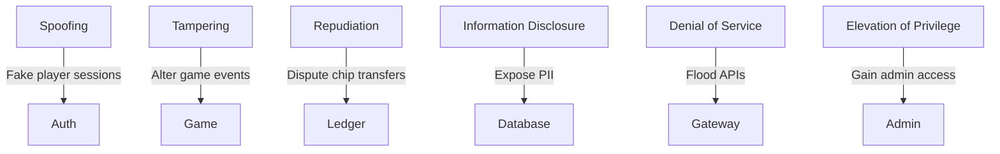

# Backend STRIDE Threat Model

This diagram highlights representative threats across PokerHub. The sections
below enumerate STRIDE threats and mitigations across all backend modules.

See [Incident Response Runbook](incident-response.md) for detection sources and escalation procedures.

## STRIDE Summary

| Category | Outcome | Runbook |
| --- | --- | --- |
| Spoofing | Fake player sessions | [Collusion Review](../runbooks/collusion-review.md) |
| Tampering | Altered data or configs | [Incident Procedures](../runbooks/incident-procedures.md) |
| Repudiation | Disputed transactions | [Wallet Reconciliation](../runbooks/wallet-reconciliation.md) |
| Information Disclosure | Exposed PII or secrets | [Incident Response](incident-response.md) |
| Denial of Service | Flooded APIs or resources | [Service Uptime](../runbooks/service-uptime.md) |
| Elevation of Privilege | Unauthorized admin access | [Incident Response](incident-response.md) |

## Component STRIDE Tables

### analytics
| Threat | Example | Mitigation |
| --- | --- | --- |
| Spoofing | Injecting fake telemetry events to skew metrics | Sign analytics payloads and accept events only from authenticated services |
| Tampering | Altering event metadata in transit | Use TLS and verify checksums before ingestion |
| Repudiation | Producers deny emitting certain metrics | Persist source service IDs and request hashes in immutable logs |
| Information Disclosure | Leaking sensitive player identifiers through analytics exports | Strip PII and apply access controls on dashboards |
| Denial of Service | Flooding analytics endpoint with high-volume noise | Rate-limit event ingestion and buffer through message queues |
| Elevation of Privilege | Gaining write access to analytics configuration | Restrict config endpoints to ops role and audit changes |

### auth
| Threat | Example | Mitigation |
| --- | --- | --- |
| Spoofing | Forging JWTs or session cookies | Use signed tokens with short TTLs and verify against JWKS |
| Tampering | Manipulating auth headers or callback parameters | Validate all inputs with shared schemas and enforce HTTPS |
| Repudiation | Users deny logins or privilege grants | Record login attempts with IP and device fingerprinting |
| Information Disclosure | Exposing password reset tokens or user secrets | Encrypt secrets at rest and mask tokens in logs |
| Denial of Service | Credential stuffing or login brute-force | Implement rate limits, CAPTCHA, and account lockouts |
| Elevation of Privilege | Bypassing RBAC to gain admin access | Server-side role checks and principle of least privilege |

### config
| Threat | Example | Mitigation |
| --- | --- | --- |
| Spoofing | Loading untrusted configuration sources | Only accept configs from signed bundles and verified paths |
| Tampering | Editing configuration files or environment variables | Store configs in read-only secrets manager and hash on load |
| Repudiation | Operators deny changing configuration | Track config versioning with commit history and audit logs |
| Information Disclosure | Leaking secrets through misconfigured files | Separate secrets from configs and restrict file access |
| Denial of Service | Pushing malformed configs causing crashes | Validate config schema before applying and support rollbacks |
| Elevation of Privilege | Changing feature flags to enable admin endpoints | Require signed approvals and review for privileged flags |

### database
| Threat | Example | Mitigation |
| --- | --- | --- |
| Spoofing | Impersonating database servers | Enforce TLS with certificate pinning |
| Tampering | Unauthorized modifications to records | Use role-based access and row-level permissions |
| Repudiation | Users dispute stored actions or balances | Append-only ledgers and transaction signatures |
| Information Disclosure | Dumping player data or credentials | Encrypt data at rest and restrict admin queries |
| Denial of Service | Expensive queries exhausting resources | Query timeouts, connection pooling, and throttling |
| Elevation of Privilege | Escalating to superuser via SQL injection | Parameterized queries and least-privileged DB roles |

### events
| Threat | Example | Mitigation |
| --- | --- | --- |
| Spoofing | Publishing forged domain events | Authenticate producers and sign messages |
| Tampering | Modifying events in the bus | Employ immutable logs and checksum verification |
| Repudiation | Producers deny sending critical events | Persist event provenance and timestamps |
| Information Disclosure | Exposing sensitive payloads to subscribers | Encrypt confidential fields and implement ACLs |
| Denial of Service | Event storms overwhelming consumers | Back-pressure and consumer quotas |
| Elevation of Privilege | Subscribing to unauthorized topics | Broker-level ACLs and service identity checks |

### feature-flags
| Threat | Example | Mitigation |
| --- | --- | --- |
| Spoofing | Fake flag service alters feature states | Require mTLS between flag service and clients |
| Tampering | Unauthorized flag toggles | Gate updates behind admin UI with audit logs |
| Repudiation | Operators deny changing a flag | Maintain versioned change history |
| Information Disclosure | Revealing upcoming features | Limit flag visibility by role and environment |
| Denial of Service | Flag service outage halts app startup | Cache flag states and provide sane defaults |
| Elevation of Privilege | Enabling hidden admin paths | Separate security-sensitive flags and require peer review |

### game
| Threat | Example | Mitigation |
| --- | --- | --- |
| Spoofing | Players forge game actions or state updates | Validate actions server-side and sign state transitions |
| Tampering | Manipulating game rules or RNG seeds | Store rules in code, hash RNG seeds, and verify integrity |
| Repudiation | Players dispute game outcomes | Record hand histories and RNG proofs |
| Information Disclosure | Revealing hidden cards or strategies | Encrypt in-transit data and segregate spectator views |
| Denial of Service | Flooding game engine with actions | Per-player rate limits and turn timers |
| Elevation of Privilege | Accessing privileged routes without proper auth | Centralized authorization middleware |

### gateway
| Threat | Example | Mitigation |
| --- | --- | --- |
| Spoofing | mTLS bypass between services and gateway | mTLS between services and gateway authentication |
| Tampering | Modifying route handlers at runtime | Immutable deployments and integrity checks |
| Repudiation | Services deny invoking certain endpoints | Trace IDs and request logging |
| Information Disclosure | Exposing hidden admin routes | Require auth and hide behind firewall rules |
| Denial of Service | Route enumeration or heavy payloads | Rate limiting and payload size caps |
| Elevation of Privilege | Accessing privileged routes without proper auth | Centralized authorization middleware |

### schemas
| Threat | Example | Mitigation |
| --- | --- | --- |
| Spoofing | Using malicious schema definitions | Validate schema sources and sign packages |
| Tampering | Changing schema validation rules | Version control and code reviews |
| Repudiation | Developers deny schema changes | Commit history and CI approvals |
| Information Disclosure | Schemas reveal internal fields | Separate internal vs public schemas |
| Denial of Service | Complex schemas causing validation overhead | Benchmark validators and set timeouts |
| Elevation of Privilege | Relaxed schemas allowing privilege escalation | Strict validation and authorization checks |

### scripts
| Threat | Example | Mitigation |
| --- | --- | --- |
| Spoofing | Running unauthorized maintenance scripts | Sign scripts and restrict execution permissions |
| Tampering | Modifying deployment scripts | Use CI pipelines with checksums |
| Repudiation | Operators deny running scripts | Log executions with user IDs and timestamps |
| Information Disclosure | Scripts outputting secrets | Redact sensitive values and store logs securely |
| Denial of Service | Faulty scripts consuming resources | Review and test scripts in staging |
| Elevation of Privilege | Script misuse to escalate rights | Run with least privileges and peer review |

### session
| Threat | Example | Mitigation |
| --- | --- | --- |
| Spoofing | Hijacking session IDs | Rotate IDs and bind sessions to device fingerprints |
| Tampering | Altering session state | Store session data server-side and sign tokens |
| Repudiation | Users deny actions within a session | Log actions with session IDs and timestamps |
| Information Disclosure | Session storage leaks | Encrypt session stores and enforce idle timeouts |
| Denial of Service | Session fixation or exhaustion | Limit concurrent sessions and invalidate old ones |
| Elevation of Privilege | Session fixation leading to privilege gain | Regenerate tokens after privilege change |

### storage
| Threat | Example | Mitigation |
| --- | --- | --- |
| Spoofing | Fake storage nodes supply data | Verify node certificates and checksums |
| Tampering | Modifying stored files | Use immutable object storage and versioning |
| Repudiation | Operators deny file uploads or deletions | Keep audit trails with object IDs and actors |
| Information Disclosure | Public exposure of private assets | Bucket policies and signed URLs |
| Denial of Service | Excessive storage requests or large files | Quotas and size limits |
| Elevation of Privilege | Gaining write access to protected buckets | IAM policies with least privilege |

### telemetry
| Threat | Example | Mitigation |
| --- | --- | --- |
| Spoofing | Sending fake traces or metrics | Authenticate agents and sign data |
| Tampering | Altering telemetry payloads | TLS and integrity checks |
| Repudiation | Services deny emitting traces | Link spans to service identity and persist |
| Information Disclosure | Telemetry leaks internal data | Scrub sensitive fields before export |
| Denial of Service | High-volume telemetry saturates collectors | Sampling and rate limits |
| Elevation of Privilege | Using telemetry channels to execute code | Accept only data formats and sanitize inputs |

### tournament
| Threat | Example | Mitigation |
| --- | --- | --- |
| Spoofing | Fake tournament registrations | Require authenticated API calls and server-side checks |
| Tampering | Altering blind structures or payouts | Store configs in signed records and require admin approvals |
| Repudiation | Players dispute tournament outcomes | Maintain audit logs of brackets and results |
| Information Disclosure | Leaking competitor strategies or schedules | Role-based access and masked exports |
| Denial of Service | Mass registrations or update floods | Rate limits and capacity checks |
| Elevation of Privilege | Unauthorized access to director tools | RBAC with multi-factor authentication |

### users
| Threat | Example | Mitigation |
| --- | --- | --- |
| Spoofing | Creating accounts with stolen identities | Enforce KYC and email/phone verification |
| Tampering | Modifying user profiles or balances | Role checks and server-side validation |
| Repudiation | Users deny account changes | Immutable audit logs and versioned profiles |
| Information Disclosure | Exposing personal information | Field-level encryption and GDPR compliance |
| Denial of Service | Signup or profile update floods | Captchas and rate limiting |
| Elevation of Privilege | Escalating to admin accounts | Two-factor auth and privilege separation |

### wallet
| Threat | Example | Mitigation |
| --- | --- | --- |
| Spoofing | Impersonating wallet services | Mutual TLS and signed transactions |
| Tampering | Altering transaction amounts or addresses | Double-entry accounting and checksum verification |
| Repudiation | Users deny deposits or withdrawals | Ledger with transaction hashes and confirmations |
| Information Disclosure | Revealing balances or keys | Encrypt sensitive data and restrict API responses |
| Denial of Service | Flooding wallet with micro-transactions | Minimum transaction limits and batching |
| Elevation of Privilege | Unauthorized fund transfers | Multi-sig approval and hardware key storage |

### Third-party integrations

#### Redis
| Threat | Example | Mitigation |
| --- | --- | --- |
| Spoofing | Rogue cache node intercepts requests | Enable TLS and authenticate nodes |
| Tampering | Manipulating cached session data | Use data signing and short TTLs |
| Repudiation | Node denies serving keys | Log operations and monitor replication |
| Information Disclosure | Cache snooping reveals PII | Avoid storing secrets and restrict access |
| Denial of Service | Cache exhaustion via large keys | Quotas and eviction policies |
| Elevation of Privilege | Gaining admin access to Redis | ACLs and isolated network segments |

#### Kafka
| Threat | Example | Mitigation |
| --- | --- | --- |
| Spoofing | Fake brokers or clients | TLS with client certificates |
| Tampering | Modifying messages in transit | Sign payloads and enable authorization |
| Repudiation | Producers deny sending messages | Broker logs with producer IDs |
| Information Disclosure | Reading unauthorized topics | Topic ACLs and encryption |
| Denial of Service | Topic flooding or slow consumers | Quotas and consumer lag monitoring |
| Elevation of Privilege | Unauthorized topic administration | RBAC and audited configuration changes |

#### ClickHouse
| Threat | Example | Mitigation |
| --- | --- | --- |
| Spoofing | Imitating analytics cluster | TLS and host whitelisting |
| Tampering | Altering stored analytics data | Append-only tables and checksums |
| Repudiation | Nodes deny executing queries | Query logging and trace IDs |
| Information Disclosure | Exposing player analytics externally | View-level permissions and redaction |
| Denial of Service | Heavy analytical queries | Resource quotas and query limits |
| Elevation of Privilege | Escalating to admin user | Separate credentials and least privilege |

#### Google Cloud Storage
| Threat | Example | Mitigation |
| --- | --- | --- |
| Spoofing | Fake GCS endpoints | Signed URLs and HTTPS |
| Tampering | Altering stored objects | Object versioning and integrity checks |
| Repudiation | Providers deny object access | Access logs and object lifecycles |
| Information Disclosure | Publicly exposed buckets | Private buckets with IAM policies |
| Denial of Service | Excessive requests or large uploads | Quotas and lifecycle rules |
| Elevation of Privilege | Misconfigured service accounts | Scoped service accounts and rotation |

#### Onfido
| Threat | Example | Mitigation |
| --- | --- | --- |
| Spoofing | Fake KYC callbacks | Verify signatures and callback IP ranges |
| Tampering | Altered identity documents | Hash validation and secure uploads |
| Repudiation | Applicant denies verification results | Store signed responses and timestamps |
| Information Disclosure | Leakage of identity data | Encrypt transmissions and limit retention |
| Denial of Service | Automated verification spam | Rate limits and captcha for uploads |
| Elevation of Privilege | Unauthorized access to KYC dashboard | SSO with MFA and role-based access |

## analytics
- **Spoofing**: Injecting fake telemetry events to skew metrics.
  - *Mitigation*: Sign analytics payloads and accept events only from authenticated services.
- **Tampering**: Altering event metadata in transit.
  - *Mitigation*: Use TLS and verify checksums before ingestion.
- **Repudiation**: Producers deny emitting certain metrics.
  - *Mitigation*: Persist source service IDs and request hashes in immutable logs.
- **Information Disclosure**: Leaking sensitive player identifiers through analytics exports.
  - *Mitigation*: Strip PII and apply access controls on dashboards.
- **Denial of Service**: Flooding analytics endpoint with high‑volume noise.
  - *Mitigation*: Rate‑limit event ingestion and buffer through message queues.
- **Elevation of Privilege**: Gaining write access to analytics configuration.
  - *Mitigation*: Restrict config endpoints to ops role and audit changes.

## auth
- **Spoofing**: Forging JWTs or session cookies.
  - *Mitigation*: Use signed tokens with short TTLs and verify against JWKS.
- **Tampering**: Manipulating auth headers or callback parameters.
  - *Mitigation*: Validate all inputs with shared schemas and enforce HTTPS.
- **Repudiation**: Users deny logins or privilege grants.
  - *Mitigation*: Record login attempts with IP and device fingerprinting.
- **Information Disclosure**: Exposing password reset tokens or user secrets.
  - *Mitigation*: Encrypt secrets at rest and mask tokens in logs.
- **Denial of Service**: Credential stuffing or login brute‑force.
  - *Mitigation*: Implement rate limits, CAPTCHA, and account lockouts.
- **Elevation of Privilege**: Bypassing RBAC to gain admin access.
  - *Mitigation*: Server‑side role checks and principle of least privilege.

## config
- **Spoofing**: Loading untrusted configuration sources.
  - *Mitigation*: Only accept configs from signed bundles and verified paths.
- **Tampering**: Editing configuration files or environment variables.
  - *Mitigation*: Store configs in read‑only secrets manager and hash on load.
- **Repudiation**: Operators deny changing configuration.
  - *Mitigation*: Track config versioning with commit history and audit logs.
- **Information Disclosure**: Leaking secrets through misconfigured files.
  - *Mitigation*: Separate secrets from configs and restrict file access.
- **Denial of Service**: Pushing malformed configs causing crashes.
  - *Mitigation*: Validate config schema before applying and support rollbacks.
- **Elevation of Privilege**: Changing feature flags to enable admin endpoints.
  - *Mitigation*: Require signed approvals and review for privileged flags.

## database
- **Spoofing**: Impersonating database servers.
  - *Mitigation*: Enforce TLS with certificate pinning.
- **Tampering**: Unauthorized modifications to records.
  - *Mitigation*: Use role‑based access and row‑level permissions.
- **Repudiation**: Users dispute stored actions or balances.
  - *Mitigation*: Append‑only ledgers and transaction signatures.
- **Information Disclosure**: Dumping player data or credentials.
  - *Mitigation*: Encrypt data at rest and restrict admin queries.
- **Denial of Service**: Expensive queries exhausting resources.
  - *Mitigation*: Query timeouts, connection pooling, and throttling.
- **Elevation of Privilege**: Escalating to superuser via SQL injection.
  - *Mitigation*: Parameterized queries and least‑privileged DB roles.

## events
- **Spoofing**: Publishing forged domain events.
  - *Mitigation*: Authenticate producers and sign messages.
- **Tampering**: Modifying events in the bus.
  - *Mitigation*: Employ immutable logs and checksum verification.
- **Repudiation**: Producers deny sending critical events.
  - *Mitigation*: Persist event provenance and timestamps.
- **Information Disclosure**: Exposing sensitive payloads to subscribers.
  - *Mitigation*: Encrypt confidential fields and implement ACLs.
- **Denial of Service**: Event storms overwhelming consumers.
  - *Mitigation*: Back‑pressure and consumer quotas.
- **Elevation of Privilege**: Subscribing to unauthorized topics.
  - *Mitigation*: Broker‑level ACLs and service identity checks.

## feature-flags
- **Spoofing**: Fake flag service alters feature states.
  - *Mitigation*: Require mTLS between flag service and clients.
- **Tampering**: Unauthorized flag toggles.
  - *Mitigation*: Gate updates behind admin UI with audit logs.
- **Repudiation**: Operators deny changing a flag.
  - *Mitigation*: Maintain versioned change history.
- **Information Disclosure**: Revealing upcoming features.
  - *Mitigation*: Limit flag visibility by role and environment.
- **Denial of Service**: Flag service outage halts app startup.
  - *Mitigation*: Cache flag states and provide sane defaults.
- **Elevation of Privilege**: Enabling hidden admin paths.
  - *Mitigation*: Separate security‑sensitive flags and require peer review.

## game
- **Spoofing**: Players forge game actions or state updates.
  - *Mitigation*: Validate actions server‑side and sign state transitions.
- **Tampering**: Manipulating game rules or RNG seeds.
  - *Mitigation*: Store rules in code, hash RNG seeds, and verify integrity.
- **Repudiation**: Players dispute game outcomes.
  - *Mitigation*: Record hand histories and RNG proofs.
- **Information Disclosure**: Revealing hidden cards or strategies.
  - *Mitigation*: Encrypt in‑transit data and segregate spectator views.
- **Denial of Service**: Flooding game engine with actions.
  - *Mitigation*: Per‑player rate limits and turn timers.
- **Elevation of Privilege**: Gaining dealer or admin controls.
  - *Mitigation*: Strict role validation and monitoring.

## leaderboard
- **Spoofing**: Faking scores to appear in rankings.
  - *Mitigation*: Accept updates only from trusted services with signed tokens.
- **Tampering**: Altering leaderboard entries.
  - *Mitigation*: Store scores in append‑only tables with checksums.
- **Repudiation**: Players deny score submissions.
  - *Mitigation*: Keep submission logs with user IDs and timestamps.
- **Information Disclosure**: Exposing private stats.
  - *Mitigation*: Mask non‑public metrics and honor privacy settings.
- **Denial of Service**: Massive queries or sort operations.
  - *Mitigation*: Cache results and paginate requests.
- **Elevation of Privilege**: Unauthorized access to admin editing tools.
  - *Mitigation*: RBAC and least‑privileged service accounts.

## logging
- **Spoofing**: Fake log entries to mislead auditors.
  - *Mitigation*: Sign log batches and require service authentication.
- **Tampering**: Editing or deleting logs.
  - *Mitigation*: Ship logs to append‑only storage with WORM policies.
- **Repudiation**: Services deny logged actions.
  - *Mitigation*: Include request hashes and actor IDs.
- **Information Disclosure**: Logs containing sensitive data.
  - *Mitigation*: Scrub secrets and enforce log access controls.
- **Denial of Service**: Log volume overwhelms storage.
  - *Mitigation*: Rate limits, sampling, and archival pipelines.
- **Elevation of Privilege**: Writing to logs to trigger exploits.
  - *Mitigation*: Sanitize log inputs and restrict log viewers.

## messaging
- **Spoofing**: Sending forged chat or notification messages.
  - *Mitigation*: Authenticate senders and sign payloads.
- **Tampering**: Altering message contents in transit.
  - *Mitigation*: Use end‑to‑end encryption where applicable.
- **Repudiation**: Users deny sending messages.
  - *Mitigation*: Timestamp and store sender IDs with audit trails.
- **Information Disclosure**: Message leakage between players.
  - *Mitigation*: Isolate channels and encrypt at rest.
- **Denial of Service**: Spamming message queues.
  - *Mitigation*: Throttle per user and apply spam filters.
- **Elevation of Privilege**: Gaining moderator abilities.
  - *Mitigation*: Strict auth checks and admin approval workflow.

## redis
- **Spoofing**: Rogue clients impersonate cache nodes.
  - *Mitigation*: Enable AUTH and network‑level ACLs.
- **Tampering**: Overwriting cached data to manipulate state.
  - *Mitigation*: Namespaced keys and TTL validation.
- **Repudiation**: Clients deny cache invalidations.
  - *Mitigation*: Log mutations with client IDs.
- **Information Disclosure**: Reading sensitive cache entries.
  - *Mitigation*: Avoid caching secrets and restrict access.
- **Denial of Service**: Cache flooding or eviction storms.
  - *Mitigation*: Eviction policies and request throttling.
- **Elevation of Privilege**: Executing dangerous Redis commands.
  - *Mitigation*: Disable unsafe commands and use user roles.

## routes
- **Spoofing**: Pretending to be internal service routes.
  - *Mitigation*: mTLS between services and gateway authentication.
- **Tampering**: Modifying route handlers at runtime.
  - *Mitigation*: Immutable deployments and integrity checks.
- **Repudiation**: Services deny invoking certain endpoints.
  - *Mitigation*: Trace IDs and request logging.
- **Information Disclosure**: Exposing hidden admin routes.
  - *Mitigation*: Require auth and hide behind firewall rules.
- **Denial of Service**: Route enumeration or heavy payloads.
  - *Mitigation*: Rate limiting and payload size caps.
- **Elevation of Privilege**: Accessing privileged routes without proper auth.
  - *Mitigation*: Centralized authorization middleware.

## schemas
- **Spoofing**: Using malicious schema definitions.
  - *Mitigation*: Validate schema sources and sign packages.
- **Tampering**: Changing schema validation rules.
  - *Mitigation*: Version control and code reviews.
- **Repudiation**: Developers deny schema changes.
  - *Mitigation*: Commit history and CI approvals.
- **Information Disclosure**: Schemas reveal internal fields.
  - *Mitigation*: Separate internal vs public schemas.
- **Denial of Service**: Complex schemas causing validation overhead.
  - *Mitigation*: Benchmark validators and set timeouts.
- **Elevation of Privilege**: Relaxed schemas allowing privilege escalation.
  - *Mitigation*: Strict validation and authorization checks.

## scripts
- **Spoofing**: Running unauthorized maintenance scripts.
  - *Mitigation*: Sign scripts and restrict execution permissions.
- **Tampering**: Modifying deployment scripts.
  - *Mitigation*: Use CI pipelines with checksums.
- **Repudiation**: Operators deny running scripts.
  - *Mitigation*: Log executions with user IDs and timestamps.
- **Information Disclosure**: Scripts outputting secrets.
  - *Mitigation*: Redact sensitive values and store logs securely.
- **Denial of Service**: Faulty scripts consuming resources.
  - *Mitigation*: Review and test scripts in staging.
- **Elevation of Privilege**: Script misuse to escalate rights.
  - *Mitigation*: Run with least privileges and peer review.

## session
- **Spoofing**: Hijacking session IDs.
  - *Mitigation*: Rotate IDs and bind sessions to device fingerprints.
- **Tampering**: Altering session state.
  - *Mitigation*: Store session data server‑side and sign tokens.
- **Repudiation**: Users deny actions within a session.
  - *Mitigation*: Log actions with session IDs and timestamps.
- **Information Disclosure**: Session storage leaks.
  - *Mitigation*: Encrypt session stores and enforce idle timeouts.
- **Denial of Service**: Session fixation or exhaustion.
  - *Mitigation*: Limit concurrent sessions and invalidate old ones.
- **Elevation of Privilege**: Session fixation leading to privilege gain.
  - *Mitigation*: Regenerate tokens after privilege change.

## storage
- **Spoofing**: Fake storage nodes supply data.
  - *Mitigation*: Verify node certificates and checksums.
- **Tampering**: Modifying stored files.
  - *Mitigation*: Use immutable object storage and versioning.
- **Repudiation**: Operators deny file uploads or deletions.
  - *Mitigation*: Keep audit trails with object IDs and actors.
- **Information Disclosure**: Public exposure of private assets.
  - *Mitigation*: Bucket policies and signed URLs.
- **Denial of Service**: Excessive storage requests or large files.
  - *Mitigation*: Quotas and size limits.
- **Elevation of Privilege**: Gaining write access to protected buckets.
  - *Mitigation*: IAM policies with least privilege.

## telemetry
- **Spoofing**: Sending fake traces or metrics.
  - *Mitigation*: Authenticate agents and sign data.
- **Tampering**: Altering telemetry payloads.
  - *Mitigation*: TLS and integrity checks.
- **Repudiation**: Services deny emitting traces.
  - *Mitigation*: Link spans to service identity and persist.
- **Information Disclosure**: Telemetry leaks internal data.
  - *Mitigation*: Scrub sensitive fields before export.
- **Denial of Service**: High‑volume telemetry saturates collectors.
  - *Mitigation*: Sampling and rate limits.
- **Elevation of Privilege**: Using telemetry channels to execute code.
  - *Mitigation*: Accept only data formats and sanitize inputs.

## tournament
- **Spoofing**: Fake tournament registrations.
  - *Mitigation*: Require authenticated API calls and server‑side checks.
- **Tampering**: Altering blind structures or payouts.
  - *Mitigation*: Store configs in signed records and require admin approvals.
- **Repudiation**: Players dispute tournament outcomes.
  - *Mitigation*: Maintain audit logs of brackets and results.
- **Information Disclosure**: Leaking competitor strategies or schedules.
  - *Mitigation*: Role‑based access and masked exports.
- **Denial of Service**: Mass registrations or update floods.
  - *Mitigation*: Rate limits and capacity checks.
- **Elevation of Privilege**: Unauthorized access to director tools.
  - *Mitigation*: RBAC with multi‑factor authentication.

## users
- **Spoofing**: Creating accounts with stolen identities.
  - *Mitigation*: Enforce KYC and email/phone verification.
- **Tampering**: Modifying user profiles or balances.
  - *Mitigation*: Role checks and server‑side validation.
- **Repudiation**: Users deny account changes.
  - *Mitigation*: Immutable audit logs and versioned profiles.
- **Information Disclosure**: Exposing personal information.
  - *Mitigation*: Field‑level encryption and GDPR compliance.
- **Denial of Service**: Signup or profile update floods.
  - *Mitigation*: Captchas and rate limiting.
- **Elevation of Privilege**: Escalating to admin accounts.
  - *Mitigation*: Two‑factor auth and privilege separation.

## wallet
- **Spoofing**: Impersonating wallet services.
  - *Mitigation*: Mutual TLS and signed transactions.
- **Tampering**: Altering transaction amounts or addresses.
  - *Mitigation*: Double‑entry accounting and checksum verification.
- **Repudiation**: Users deny deposits or withdrawals.
  - *Mitigation*: Ledger with transaction hashes and confirmations.
- **Information Disclosure**: Revealing balances or keys.
  - *Mitigation*: Encrypt sensitive data and restrict API responses.
- **Denial of Service**: Flooding wallet with micro‑transactions.
  - *Mitigation*: Minimum transaction limits and batching.
- **Elevation of Privilege**: Unauthorized fund transfers.
  - *Mitigation*: Multi‑sig approval and hardware key storage.

